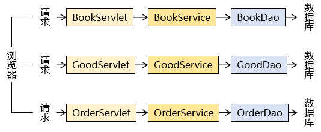

### 技术体系结构

#### 总体技术体系

##### 单一架构

​	一个项目，一个工程，导出为一个war包，在一个Tomcat上运行。


单一架构，项目主要应用技术框架为：Spring、SpringMVC，Mybatis

##### 分布式架构

一个项目，拆分成很多个模块，每个模块是一个IDEA中的一个module。每一个工程都是运行在自己的Tomcat上。模块之间可以互相调用。每一个模块内部可以看成是一个单一架构的应用。


分布式架构，项目主要应用技术框架：SpringBoot(SSM)、SpringCloud，中间件等

#### 框架概念和理解

框架（Framework）是一个集成了基本结构、规范、设计模式、编程语言和程序库等基础组件的软件系统，它可以用来构建更高级别的应用程序。框架的设计和实现旨在解决特定领域的常见问题，帮助开发人员更高效、更稳定地实现软件开发目标。

**框架的优点**

- 提高开发效率
- 降低开发成本
- 提高应用程序的稳定性
- 提高标准化的解决方案

**框架的缺点**

- 可能存在局限性
- 版本变更和兼容性问题
- 架构风险

### SpringFramework

#### Spring和SpringFramework概念

**广义的Spring：Spring技术栈**

广义上的 Spring 泛指以 Spring Framework 为基础的 Spring 技术栈。

经过十多年的发展，Spring 已经不再是一个单纯的应用框架，而是逐渐发展成为一个由多个不同子项目（模块）组成的成熟技术，例如 Spring Framework、Spring MVC、SpringBoot、Spring Cloud、Spring Data、Spring Security 等，其中 Spring Framework 是其他子项目的基础。

这些子项目涵盖了从企业级应用开发到云计算等各方面的内容，能够帮助开发人员解决软件发展过程中不断产生的各种实际问题，给开发人员带来了更好的开发体验。

**狭义的Spring：Spring Framework基础框架**

狭义的 Spring 特指 Spring Framework，通常我们将它称为 Spring 框架。

经过十多年的发展，Spring 已经不再是一个单纯的应用框架，而是逐渐发展成

#### SpringFramework主要功能模块

SpringFramework框架结构图：


| 功能模块       | 功能介绍                                              |
| -------------- | ----------------------------------------------------- |
| Core Container | 核心容器，在Spring环境下使用任何功能都必须基于IOC容器 |
| AOP&Aspects    | 面向切面编程                                          |
| TX             | 声明式事务管理                                        |
| Spring MVC     | 提供了面向Web应用程序的集成功能                       |

#### SpringFramework主要优势

- 丰富的生态系统：Spring生态系统非常丰富，支持许多模块和库，如Spring Boot、Spring Security、Sping Cloud等等，可以帮助开发人员快速构建高可靠性的企业应用程序
- 模块化的设计：框架组件之间的松散耦合和模块化设计使得Spring Framework具有良好的可重用性、可扩张性和可维护性。开发人员可以轻松地选择自己需要的模块，根据自己的需求进行开发
- 简化Java开发：Spring Framework简化了Java开发，提供了各种工具和API，可以降低开发复杂度和学习成本。同时Spring Framework支持各种应用场景，包括Web应用程序、RESTful API、消息传递、批处理等等
- 不断创新和发展：Spring Framework开发团队一直在不断创新和发展，保持与最新的技术接轨，为开发人员提供更加游戏和先进的工具和框架。

Spring 使创建 Java 企业应用程序变得容易。它提供了在企业环境中采用 Java 语言所需的一切，支持 Groovy 和 Kotlin 作为 JVM 上的替代语言，并且可以根据应用程序的需求灵活地创建多种架构。从Spring Framework 6.0.6开始，Spring 需要 Java 17+。

### Spring IoC容器

#### 组件和组件管理概念

三层架构处理请求流程：



整个项目就是由各种组件搭建而成：


#### Spring充当组件管理角色(IoC)

组件可以完全交给Spring框架进行管理，Spring框架替代了开发人员原有的new对象属性赋值动作等

Spring具体的组件管理动作包含：

- 组件对象实例化
- 组件属性的赋值
- 组件对象之间引用
- 组件对象存活周期管理
- 我们只需要编写配置文件告知Spring管理哪些类组件和它们的依赖关系即可；组件是映射到应用程序中所有可重用组件的Java对象，应该是可复用的功能对象
- 组件一定是对象
- 对象不一定是组件

综上所述，Spring充当一个组件容器，创建、管理、存储组件，减少了我们的编码压力，让我们更加专注进行业务编写。

**组件交给Spring管理优势**

- 降低了组件之间的耦合性：Spring IoC容器通过依赖注入机制，将组件之间的依赖关系消弱，减少了程序组件之间的耦合性，使得组件更加松散地耦合
- 提高了代码的可复用性和可维护性：将组件的实例化过程、依赖关系的管理等功能交给Spring IoC容器处理，使得组件代码更加模块化、可重用、更易于维护
- 方便了配置和管理：Spring IoC容器通过XML文件或注解，轻松的对组件进行配置和管理，使得组件的切换、替换等操作更加的方便和快捷。
- 交给Spring管理的对象（组件），方可享受Spring框架的其他功能（AOP、声明事务管理）等

#### 普通容器和复杂容器

普通容器只能用来存储，没有更多功能，如数组、List、Set

复杂容器：Servlet容器能够管理Servlet(init、service、destroy)、Filter、Listener这样的组件的一生，

| 名称       | 时机                                                         | 次数 |
| ---------- | ------------------------------------------------------------ | ---- |
| 创建对象   | 默认情况下：接收到第一次请求 修改启动顺序后：Web应用启动过程中 | 一次 |
| 初始化操作 | 创建对象之后                                                 | 一次 |
| 处理请求   | 接收到请求                                                   | 多次 |
| 销毁操作   | Web应用卸载之前                                              | 一次 |

Spring管理组件的容器，就是一个复杂容器，不仅存储组件，也可以管理组件之间依赖关系，并且创建和销毁组件等

#### SpringIoC容器

SpringIoC容器，负责实例化、配置和组装bean(组件)。容器通过读取配置元数据来获取有关要实例化、配置和组装组件的指令。配置元数据以XML、Java注解或Java代码形式表现。它允许表达组成应用程序的组件以及这些组件之间丰富的互相依赖关系


#### Spring容器接口

`BeanFactory`接口提供了一种高级配置机制，能够管理任何类型的对象，它是SpringIoC容器标准化超接口

`ApplicationContext`是`BeanFactory`的子接口。

- 更容易与Spring的AOP功能集成
- 消息资源处理（易于国际化）
- 特定与应用程序给予此接口实现，如Web应用的WebApplicationContext。换言之。BeanFactory提供了配置框架和基本功能，而ApplicationContext添加了更多特定与企业的功能。ApplicationContext是BeanFactory的完整超集

| 类型名                             | 简介                                                         |
| ---------------------------------- | ------------------------------------------------------------ |
| ClassPathXmlApplicationContext     | 通过读取类路径下的XML配置文件创建IOC容器对象                 |
| FileSystemXmlApplicationContext    | 通过文件系统路径读取XML格式配置文件创建IOC容器对象           |
| AnnotationConfigApplicationContext | 通过读取Java配置类创建IOC容器对象                            |
| WebApplicationContext              | 专门为Web应用准本，基于Web环境创建IOC容器对象，并将对象引入存入ServletContext域中 |

#### SpringIoC容器管理配置方式

Spring IoC容器使用多种形式的配置元数据。此配置元数据表示作为应用程序开发人员如何告知Spring容器实例化、配置和组装到应用程序中的对象。

Spring框架提供了多种配置方式：XML配置方式、注解方式和Java配置类方式

- XML配置方式：是Spring框架最早的配置方式之一，通过在XML文件中定义Bean及其依赖关系、Bean的作用域等信息，让Spring IoC容器来管理Bean之间的依赖关系。该方法从Spring框架的第一版开始提供支持
- 注解方式：Spring2.5版本开始提供支持，可以通过在Bean类上使用注解代替XML配置文件中的配置信息。通过在Bean类上加上相应的注解（如@Component、@Service、@Autowired等），将Bean注册到Spring IoC容器中，这样Spring IoC容器就可以管理这些Bean之间的依赖关系。
- Java配置类方式：从Spring 3.0版本开始提供支持，通过Java类来定义Bean、Bean之间的依赖关系和配置信息。从而代替XML配置文件的方式。Java配置类是一种使用Java编写配置信息的方式，通过@Configuration、@Bean等注解来实现Bean和依赖关系的配置

#### Spring IoC / DI总结

- IoC容器：

  Spring IoC容器，负责实例化、配置和组装bean(组件)核心容器。容器通过读取配置元数据来获取有关要实例化、配置和组装组件的指令

- IoC(Inversion of Control)控制反转：

  IoC主要是针对对象的创建和调用控制而言的，也就是说，当应用程序需要使用一个对象时，不再是应用程序直接创建对象，而是由IoC容器来创建和管理，即控制权由应用程序转移到IoC容器中，也就是反转了控制权。这种方式基本上是通过依赖查询找的方式来实现的，即IoC容器维护着构成应用程序的对象，并负责创建这些对象

- DI(Dependency Injection)依赖注入

  DI是指在组件之间传递依赖关系的过程中，将依赖关系在容器内部进行处理，这样就不必在应用程序代码中硬编码对象之间的依赖关系，实现了对象之间的解耦合。在Spring中，DI是通过XML配置文件或注解的方式实现的。它提供了三种形式的依赖注入：构造函数注入、Setter方法注入和接口注入

### Spring IoC实践和应用

#### Spring IoC/DI实现步骤

**1.配置元数据**

```xml
<?xml version="1.0" encoding="UTF-8"?>
<!-- Spring约束 -->
<beans xmlns="http://www.springframework.org/schema/beans"
       xmlns:xsi="http://www.w3.org/2001/XMLSchema-instance"
       xsi:schemaLocation="http://www.springframework.org/schema/beans http://www.springframework.org/schema/beans/spring-beans.xsd">

    <bean id="happyComponent" class="ioc01.com.canvs.ioc.ioc01.HappyComponent"/>
</beans>
```

- `id`属性是标识单个Bean定义的字符串

- `class`属性定Bean的类型并使用完全限定的类名

**2.实例化IoC容器**

```java
//实例化ioc容器,读取外部配置文件,最终会在容器内进行ioc和di动作
ApplicationContext context = new ClassPathXmlApplicationContext("services.xml", "daos.xml");
```

**3.获取Bean（组件）**

```java
//创建ioc容器对象，指定配置文件，ioc也开始实例组件对象
ApplicationContext context = new ClassPathXmlApplicationContext("services.xml", "daos.xml");
//获取ioc容器的组件对象
PetStoreService service = context.getBean("petStore", PetStoreService.class);
//使用组件对象
List<String> userList = service.getUsernameList();
```

### 基于XML配置方式组件管理

#### 组件（Bean）信息声明配置IOC


pom.xml

```xml
<dependencies>
        <dependency>
            <groupId>org.springframework</groupId>
            <artifactId>spring-context</artifactId>
            <version>6.0.6</version>
        </dependency>
        <!--junit5测试-->
        <dependency>
            <groupId>org.junit.jupiter</groupId>
            <artifactId>junit-jupiter-api</artifactId>
            <version>5.3.1</version>
        </dependency>
    </dependencies>
```

##### 基于无参数构造函数

组件类

```java
public class HappyComponent {
    public void doWork(){
        System.out.println("HappyComponent.doWork");
    }
}
```

xml配置文件

```xml
<bean id="happyComponent" class="ioc01.com.canvs.ioc.ioc01.HappyComponent"/>
```

测试

```java
 public void testHappyComponent() {
        HappyComponent happyComponent = context.getBean("happyComponent", HappyComponent.class);
        happyComponent.doWork();
    }
```

> 注意：要求当前组件类必须包含无参数构造函数

##### 基于静态工厂方法实例化

组件类

```java
public class ClientService {
    public static ClientService clientService = new ClientService();
    public static ClientService createInstance(){
        return clientService;
    }
}
```

xml配置文件

```xml
<bean id="clientService" class="ioc01.com.canvs.ioc.ioc01.ClientService" factory-method="createInstance"/>
```

- factory-method：指定静态工厂方法，该方法必须是**static**方法

测试

```java
public void testClientService() {
        ClientService clientService = context.getBean("clientService", ClientService.class);
        System.out.println(clientService);
    }
```

##### 基于实例工厂方法实例化

```java
public class DefaultServiceLocator {
    public ClientService createClientService(){
        return new ClientService();
    }
}
```

```xml
<bean id="defaultServiceLocator" class="ioc01.com.canvs.ioc.ioc01.DefaultServiceLocator"/>
    <bean id="clientService1" factory-bean="defaultServiceLocator" factory-method="createClientService"/>
```

- factory-bean属性：指定当前容器中工厂Bean的名称
- factory-method属性：指定实例工厂方法名。实例方法必须是**非static**的

测试

```java
public void testDefaultServiceLocator(){
        ClientService clientService = context.getBean("clientService1", ClientService.class);
        System.out.println(clientService);
    }
```

##### IoC配置流程


#### 组件（Bean）依赖注入配置（DI）


##### 基于构造函数的依赖注入（单个构造参数）

组件类

```java
public class UserService {
    public UserDao userDao;
    public UserService( UserDao userDao) {
        this.userDao = userDao;
    }
}
```

xml配置

- constructor-arg标签：可以引用构造参数ref引用其他bean的标识

```xml
  <bean id="userDao" class="ioc02.com.canvs.ioc.ioc01.UserDao"/>
    <bean id="userService" class="ioc02.com.canvs.ioc.ioc01.UserService">
        <constructor-arg name="userDao" ref="userDao"/>
    </bean>
```

测试

```java
  public void testUserService(){
        UserService userService = context.getBean("userService", UserService.class);
        System.out.println(userService.userDao);
    }
```

##### 基于构造函数的依赖注入（多构造参数解析）

组件类

```java
public class UserService {
    public UserDao userDao;
    public int id;
    public String name;

    public UserService( UserDao userDao) {
        this.userDao = userDao;
    }

    public UserService(UserDao userDao, int id, String name) {
        this.userDao = userDao;
        this.id = id;
        this.name = name;
    }

    @Override
    public String toString() {
        return "UserService{" +
                "userDao=" + userDao +
                ", id=" + id +
                ", name='" + name + '\'' +
                '}';
    }
}
```

xml配置文件

- constructor-arg标签：name属性指定参数名、index属性指定参数角标、value属性指定普通属性值

```xml
 <bean id="userService2" class="ioc02.com.canvs.ioc.ioc01.UserService">
        <constructor-arg name="userDao" ref="userDao"/>
        <constructor-arg name="id" value="1001"/>
        <constructor-arg name="name" value="canvs"/>
    </bean>
```

测试

```java
public void testUserService2(){
        UserService userService1 = context.getBean("userService2", UserService.class);
        System.out.println(userService1);   //UserService{userDao=ioc02.com.canvs.ioc.ioc01.UserDao@c333c60, id=1001, name='canvs'}
    }
```

##### 基于Setter方法依赖注入

组件类

```java
public class SimpleMovieLister {
    private MovieFinder movieFinder;
    private String movieName;
    public void setMovieFinder(MovieFinder movieFinder) {
        this.movieFinder = movieFinder;
    }

    public void setMovieName(String movieName) {
        this.movieName = movieName;
    }

    public String getMovieName() {
        return movieName;
    }
}
class MovieFinder{

}
```

xml配置文件

- property标签：可以给setter方法对应的属性赋值
- property标签：name属性代表set方法标识、ref代表引用bean的标识id、value属性表示基本属性值

```xml
<bean class="ioc02.com.canvs.ioc.ioc01.MovieFinder" id="movieFinder"/>
    <bean class="ioc02.com.canvs.ioc.ioc01.SimpleMovieLister" id="simpleMovieLister">
        <property name="movieFinder" ref="movieFinder"/>
        <property name="movieName" value="喜剧之王"/>
    </bean>
```

测试

```java
   public void testSimpleMovieLister(){
        SimpleMovieLister simpleMovieLister = context.getBean("simpleMovieLister", SimpleMovieLister.class);
        System.out.println(simpleMovieLister.getMovieName());
    }
```

> 总结：依赖注入（DI）包含引用类型和基本数据类型，同时注入的方法也有多种，主流的注入方式为setter方法注入和构造函数注入
>
> 注意：引用其他的bean，使用ref属性。直接注入基本类型值，使用value属性

#### IoC容器创建和使用

**容器实例化**

```java
    public void getBeanFormIoC(){
        ApplicationContext context1 = new ClassPathXmlApplicationContext("Spring-ioc-xml-01.xml");
        ClassPathXmlApplicationContext applicationContext = new ClassPathXmlApplicationContext();
        applicationContext.setConfigLocations("Spring-ioc-xml-01.xml");
        applicationContext.refresh();   //ioc di的动作
    }
```

**Bean对象读取**

- id获取
- id和类型获取
- 类型获取

```java
    public void testHappyComponent() {
        HappyComponent happyComponent = context.getBean("happyComponent", HappyComponent.class);
      Object happyComponent1 = context.getBean("happyComponent");
      HappyComponent happyComponent2 = (HappyComponent1);
      happyComponent.doWork();
    }
```

```java
    public void testHappyComponent2() {
        HappyComponent happyComponent = context.getBean(HappyComponent.class);
        happyComponent.doWork();
    }
```

>根据类型来获取bean时，在满足bean唯一性的前提下，其实只是看：『对象 instanceof 指定的类型』的返回结果，
>只要返回的是true就可以认定为和类型匹配，能够获取到。

#### 组件（Bean）周期方法配置

我们可以在组件类中定义方法，然后当IoC容器实例化和销毁组件对象的时候就行调用。这两个方法我们成为生命周期方法

类似于Servlet的init/destroy方法，我们可以在周期方法完成初始化和释放资源等操作

周期方法声明

```java
public class BeanOne {
    public void init(){
        System.out.println("正在初始化BeanOne");
    }
    public void destroy(){
        System.out.println("BeanOne正在销毁");
    }
}
```

周期方法配置

```xml
<bean id="beanOne" class="ioc03.com.canvs.ioc.ioc01.BeanOne" init-method="init" destroy-method="destroy"/>
```

测试

```java
    public void testBeanOne(){
        ClassPathXmlApplicationContext applicationContext = new ClassPathXmlApplicationContext();
        applicationContext.setConfigLocations("Spring-ioc-xml-03.xml");
        applicationContext.refresh();
        BeanOne beanOne = applicationContext.getBean("beanOne", BeanOne.class);
        applicationContext.close();
    }
//正在初始化BeanOne
//BeanOne正在销毁
```

> 注意：周期方法命名随意，初始化方法和销毁方法只能是public void修饰的，没有行参。

#### 组件（Bean）作用域方法配置

Bean作用域概念：\<bean> 标签声明Bean，只是将Bean的信息配置交给SpringIoC容器。

在IoC容器中，这些\<bean>标签对应的信息转成Spring内部 `Beandefinition` 对象，Beandefinition对象内，包含定义的信息(id、class、属性等等)

这意味着，Beandefinition与类概念一样，SpringIoC容器可以根据 Beandefinition对象反射创建多个Bean对象实例。具体创建多少个Bean的实例对象，由Bean的作用域 Scope 属性指定

**作用域可选值**

| 取值      | 含义                                    | 创建对象时机    | 默认值 |
| --------- | --------------------------------------- | --------------- | ------ |
| singleton | 在IOC容器中，这个bean的对象始终为单实例 | IOC容器初始化时 | 是     |
| prototype | 这个bean在IOC容器中有多个实例           | 获取bean时      | 否     |

**如果是在WebApplicationContext环境下还会有另外两个作用域**

| 取值     | 含义                 | 创建对象时机 | 默认值 |
| -------- | -------------------- | ------------ | ------ |
| request  | 请求范围内有效的实例 | 每次请求     | 否     |
| response | 会话范围内有效的实例 | 每次会话     | 否     |

xml配置scope

```xml
 <!--  scope默认值是singleton   -->
    <bean id="beanOne2" class="ioc03.com.canvs.ioc.ioc01.BeanOne" scope="singleton"/>
    <bean id="beanOne3" class="ioc03.com.canvs.ioc.ioc01.BeanOne" scope="prototype"/>
```

测试

```java
public void testBeanOne2(){
        ApplicationContext context = new ClassPathXmlApplicationContext("Spring-ioc-xml-03.xml");
        BeanOne beanOne2 = context.getBean("beanOne2", BeanOne.class);
        BeanOne beanOne3 = context.getBean("beanOne2", BeanOne.class);
        System.out.println(beanOne3 == beanOne2);   //true
        BeanOne beanOne4 = context.getBean("beanOne3", BeanOne.class);
        BeanOne beanOne5 = context.getBean("beanOne3", BeanOne.class);
        System.out.println(beanOne5 == beanOne4);   //false
    }
```

#### FactoryBean特性和使用

`FactoryBean`接口是Spring IoC容器实例化逻辑的可插拔特点。用于配置复杂的Bean对象，可以将创建存储在FactoryBean的getObect方法

FactoryBean\<T> 接口提供三种方法：

- T getObject()：返回此工厂创建的对象的实例。该返回值会被存储到IoC容器
- boolean isSingleton()：如果此FactoryBean返回单列。则返回true。否则返回false。此方法的默认实现返回true（注意：lombok插件使用，可能影响效果）
- Class<?> getObjectType()：返回getObject()方法返回的对象类型，如果事先不知道类型，则返回null


**FactoryBean使用场景**

- 代理类的创建
- 第三方框架整合
- 复杂对象实例化等

**FactoryBean应用**

```java
public class HappyMachine {
    public String getMachineName() {
        return machineName;
    }

    private String machineName;

    public void setMachineName(String machineName) {
        this.machineName = machineName;
    }
}
```

FactoryBean实现类

```java
public class HappyFactoryBean implements FactoryBean<HappyMachine> {
    private String machineName;
    public void setMachineName(String machineName) {
        this.machineName = machineName;
    }
    @Override
    public HappyMachine getObject() throws Exception {
        HappyMachine happyMachine = new HappyMachine();
        happyMachine.setMachineName(this.machineName);
        return happyMachine;
    }

    @Override
    public Class<?> getObjectType() {
        //返回要生产的对象的类型
        return HappyMachine.class;
    }
}
```

xml配置FactoryBean实现类

```xml
<?xml version="1.0" encoding="UTF-8"?>
<beans xmlns="http://www.springframework.org/schema/beans"
       xmlns:xsi="http://www.w3.org/2001/XMLSchema-instance"
       xsi:schemaLocation="http://www.springframework.org/schema/beans http://www.springframework.org/schema/beans/spring-beans.xsd">

<!--  这个bean标签中class属性指定的是HappyFactoryBean，但是将来从这儿获取的bean是HappyMachine对象  -->
    <bean id="happyMachine" class="ioc04.com.canvs.ioc.ioc01.HappyFactoryBean">
        <property name="machineName" value="canvs"/>
    </bean>
</beans>
```

测试获取FactoryBean和FactoryBean.getObject对象

```java
    public void testFactoryBean(){
        ClassPathXmlApplicationContext applicationContext = new ClassPathXmlApplicationContext("Spring-ioc-xml-04.xml");
        //直接根据FactoryBean的id，获取的是getObject方法返回的对象
        HappyMachine happyMachine = applicationContext.getBean("happyMachine", HappyMachine.class);
        System.out.println(happyMachine.getMachineName());
        System.out.println(happyMachine);
        //如果想要获取FactoryBean对象，直接在id前添加&符号即可
        HappyFactoryBean bean = applicationContext.getBean("&happyMachine", HappyFactoryBean.class);
        System.out.println(bean);
    }
```

**FactoryBean和BeanFactory区别**

FactoryBean是Spring中一种特殊的bean，可以在getObject()工厂方法自定义的逻辑创建Bean，是一种能够过生成其他Bean的Bean。FactoryBean 在容器启动时被创建，而在世纪使用时则是通过调用getObject()方法来得到其所生产的Bean。因此，FactoryBean可以自定义任何所需的初始化逻辑，生产出一些定制化的bean

BeanFactory是Spring框架的基础，其作为一个顶级接口定义了容器的基本行为，例如管理bean的生命周期、配置文件的加载和解析、bean的装配和依赖注入等。BeanFactory接口提供了访问bean的方式，如getBean()方法获取指定的bean实例。它可以从不同的来源（如Mysql数据库、xml文件、Java配置类等）获取bean定义，并将其转换为bean实例。同时，BeanFactory还包含了很多子类（ApplicationContext接口）提供了额外的强大功能。

总的来说，FactoryBean和BeanFactory的区别主要是在于前者用于创建bean的接口，它提供了更加灵活的初始化定制功能，而后者是用于管理bean的框架基础接口，提供了基本的容器功能和bean生命周期管理

#### 基于XML方式整合三层架构组件

数据库准备

```sql
CREATE DATABASE studb;

use studb;

CREATE TABLE students(
	id INT PRIMARY KEY,
	name VARCHAR(50) NOT NULL,
	gender VARCHAR(10) NOT null,
	age INT,
	class VARCHAR(50)
);

INSERT INTO students(id,name,gender,age,class) VALUES
(1, '张三', '男', 20, '高中一班'),
  (2, '李四', '男', 19, '高中二班'),
  (3, '王五', '女', 18, '高中一班'),
  (4, '赵六', '女', 20, '高中三班'),
  (5, '刘七', '男', 19, '高中二班'),
  (6, '陈八', '女', 18, '高中一班'),
  (7, '杨九', '男', 20, '高中三班'),
  (8, '吴十', '男', 19, '高中二班');
	
SELECT id,name,gender,age,class AS classes FROM students;
```

POJO类准备

```java
public class Student {
    private int id;
    private String name;
    private String gender;
    private int age;
    private String classes;
    public Student() {
    }
    public int getId() {
        return id;
    }
    public void setId(int id) {
        this.id = id;
    }
    public String getName() {
        return name;
    }
    public void setName(String name) {
        this.name = name;
    }
    public String getGender() {
        return gender;
    }
    public void setGender(String gender) {
        this.gender = gender;
    }
    public int getAge() {
        return age;
    }
    public void setAge(int age) {
        this.age = age;
    }
    public String getClasses() {
        return classes;
    }
    public void setClasses(String classes) {
        this.classes = classes;
    }
    @Override
    public String toString() {
        return "Student{" +
                "id=" + id +
                ", name='" + name + '\'' +
                ", gender='" + gender + '\'' +
                ", age=" + age +
                ", classes='" + classes + '\'' +
                '}';
    }
}

```

持久层

```java
public interface StudentDAO {
    List<Student> getAll();
}
public class StudentDAOImpl implements StudentDAO {
    private JdbcTemplate jdbcTemplate;

    public void setJdbcTemplate(JdbcTemplate jdbcTemplate) {
        this.jdbcTemplate = jdbcTemplate;
    }
    @Override
    public List<Student> getAll() {
        String sql = "SELECT id,name,gender,age,class AS classes FROM students";
        List<Student> studentList = jdbcTemplate.query(sql, new BeanPropertyRowMapper<>(Student.class));
        return studentList;
    }
}
```

业务层

```java
public interface StudentService {
    List<Student> getAll();
}
public class StudentServiceImpl implements StudentService{
    private StudentDAO studentDAO;
    public void setStudentDAO(StudentDAO studentDAO) {
        this.studentDAO = studentDAO;
    }
    @Override
    public List<Student> getAll() {
        return studentDAO.getAll();
    }
}
```

表述层

```java
public class StudentController {
    private StudentService studentService;

    public void setStudentService(StudentService studentService) {
        this.studentService = studentService;
    }

    public void getAll() {
        List<Student> all = studentService.getAll();
        System.out.println("表述层：" + all);
    }
}
```

三层架构IoC的xml配置

```xml
<?xml version="1.0" encoding="UTF-8"?>
<beans xmlns="http://www.springframework.org/schema/beans"
       xmlns:xsi="http://www.w3.org/2001/XMLSchema-instance"
       xmlns:context="http://www.springframework.org/schema/context"
       xsi:schemaLocation="http://www.springframework.org/schema/beans http://www.springframework.org/schema/beans/spring-beans.xsd http://www.springframework.org/schema/context https://www.springframework.org/schema/context/spring-context.xsd">

    <!-- 导入外部属性文件   -->
    <context:property-placeholder location="classpath:jdbc.properties"/>

    <!-- 配置数据源   -->
    <bean id="druidDataSource" class="com.alibaba.druid.pool.DruidDataSource">
        <property name="url" value="${url}"/>
        <property name="driverClassName" value="${driver}"/>
        <property name="username" value="${username}"/>
        <property name="password" value="${password}"/>
    </bean>

    <!--配置JdbcTemplate-->
    <bean id="jdbcTemplate" class="org.springframework.jdbc.core.JdbcTemplate">
        <property name="dataSource" ref="druidDataSource"/>
    </bean>

    <bean id="studentDAO" class="practice.com.canvs.ioc.ioc01.StudentDAOImpl">
        <property name="jdbcTemplate" ref="jdbcTemplate"/>
    </bean>
    <bean id="studentService" class="practice.com.canvs.ioc.ioc01.StudentServiceImpl">
        <property name="studentDAO" ref="studentDAO"/>
    </bean>
    <bean id="studentController" class="practice.com.canvs.ioc.ioc01.StudentController">
        <property name="studentService" ref="studentService"/>
    </bean>
</beans>
```

测试

```java
public void test(){
        ClassPathXmlApplicationContext applicationContext = new ClassPathXmlApplicationContext("Spring-ioc-xml-practice.xml");
        StudentController studentController = applicationContext.getBean(StudentController.class);
        studentController.getAll();
    }
```

总结：

- 注入的属性必须要添加setter方法、代码结构乱
- 配置文件和java代码分离、编写不方便
- XML配置文件解析效率低

### 基于注解方式管理Bean

####  Bean注解标记和扫描（IoC）

注解和XML配置文件一样，注解本身并不能执行，注解本身仅仅只是做了一个标记，具体的功能是框架检测到注解标记的位置，然后针对这个位置按照注解标记的功能来执行具体操作。

本质上：所有一切的操作都是Java代码来 完成的，XML和注解只是告诉框架中的Java代码如何执行。

**扫描**

Spring为了知道开发人员在哪些地方标记了什么注解，就需要通过扫描的方式，来进行检测。然后根据注解进行后续操作。

**组件标记主机和区别**

Spring提供了多个注解，这些注解可以直接标注在Java类上，将它们定义为Spring Bean

| 注解        | 说明                                                         |
| ----------- | ------------------------------------------------------------ |
| @Component  | 该注解用于描述Spring中的Bean，它是一个泛化的概念，仅仅表示容器中的一个组件（Bean），并且可以作用在应用的任何层次。例如Service层、DAO层等。使用时只需要将该注解标注在相应的类上即可 |
| @Repository | 该注解用于数据访问层（DAO层）的类标识为Spring中的Bean，其功能与@Component相同 |
| @Service    | 该注解通常作用在业务层（Service层），用于业务层的类标识为Spring中的Bean，其功能与@Component相同 |
| @Controller | 该注解通常作用在控制层（如SpringMVC的Controller），用于将控制层的类标识为Spring中的Bean，其功能与@Component相同 |

通过查看源码得知，@Controller、@Service、@Repository这三个注解只是在@Component注解的基础上起了三个新的名字。

对于Spring使用IOC容器管理这些组件来说没有区别，也就是语法层面没有区别。所以@Controller、@Service、@Repository这三个注解只是给开发人员看的，让我们能够便于分辨组件的作用

注意：虽然它们本质上一样，但是为了代码的可读性、程序结构严谨。不能随便胡乱标记

**普通组件**

```java
@Component
public class CommonComponent {
    public void show(){
        System.out.println("CommonComponent ... ");
    }
}
```

**Controller组件**

```java
@Controller
public class UserController {
    public void show(){
        System.out.println("UserController ... ");
    }
}
```

**Service组件**

```java
@Service
public class UserServiceImpl {
    public void show(){
        System.out.println("UserServiceImpl ... ");
    }
}
```

**DAO组件**

```java
@Repository
public class UserDAOImpl {
    public void show(){
        System.out.println("UserDAOImpl ... ");
    }
}
```

**测试**

```java
    public void test(){
        ClassPathXmlApplicationContext applicationContext = new ClassPathXmlApplicationContext("Spring-ioc-annotation-01.xml");
        CommonComponent commonComponent = applicationContext.getBean(CommonComponent.class);
        commonComponent.show(); //CommonComponent ...
        UserController userController = applicationContext.getBean(UserController.class);
        userController.show();  //UserController ...
        UserServiceImpl userService = applicationContext.getBean(UserServiceImpl.class);
        userService.show(); //UserServiceImpl ...
        UserDAOImpl userDAO = applicationContext.getBean(UserDAOImpl.class);
        userDAO.show(); //UserDAOImpl ...
    }
```

**配置文件确定扫描范围**

- 基本扫描配置

```xml
<?xml version="1.0" encoding="UTF-8"?>
<beans xmlns="http://www.springframework.org/schema/beans"
       xmlns:xsi="http://www.w3.org/2001/XMLSchema-instance"
       xmlns:context="http://www.springframework.org/schema/context"
       xsi:schemaLocation="http://www.springframework.org/schema/beans http://www.springframework.org/schema/beans/spring-beans.xsd http://www.springframework.org/schema/context https://www.springframework.org/schema/context/spring-context.xsd">

    <context:component-scan base-package="com.canvs.ioc.ioc01"/>
</beans>
```

- 指定排除组件

```xml
    <context:component-scan base-package="com.canvs.ioc.ioc01">
        <!-- context:exclude-filter标签：指定排除规则 -->
        <!-- type属性：指定根据什么来进行排除，annotation取值表示根据注解来排除 -->
        <!-- expression属性：指定排除规则的表达式，对于注解来说指定全类名即可 -->
        <context:exclude-filter type="annotation" expression="org.springframework.stereotype.Controller"/>
    </context:component-scan>
```

- 指定扫描组件

```xml
<!-- use-default-filters属性：取值false表示关闭默认扫描规则 -->
<context:component-scan base-package="com.canvs.ioc.ioc0" use-default-filters="false">
    
    <!-- context:include-filter标签：指定在原有扫描规则的基础上追加的规则 -->
    <context:include-filter type="annotation" expression="org.springframework.stereotype.Controller"/>
</context:component-scan>
```

**组件BeanName问题**

在使用xml方式管理bean的时候，每一个bean都有一个唯一标识id属性的值，便于在其他地方引用。现在使用注解后，每个组件仍然应该有一个唯一标识

默认情况：类名首字母小写就是bean的id；如：UserController类对应的bean的id就是userController

使用value属性指定

```java
@Controller(value = "student")	//当注解中只是设置一个属性时，value属性的属性名可以省略
public class StudentController {
}
```

总结：

- 注解方式IOC只是标记了那些类要被Spring管理

#### 组件（Bean）作用域和周期方法

**组件周期方法配置**

```java
@Component
public class BeanOne {
    @PostConstruct  //注解指定初始化方法
    public void init(){
        System.out.println("init ....");
    }
    @PreDestroy //注解指定销毁方法
    public void destroy(){
        System.out.println("destroy ....");
    }
}
```

测试

```java
    @Test
    public void test02() {
        BeanOne beanOne = applicationContext.getBean("beanOne", BeanOne.class);
        applicationContext.close();
    }
```

**组件作用域配置**

```java
@Component
@Scope(scopeName = ConfigurableBeanFactory.SCOPE_PROTOTYPE)   //多例
// @Scope(scopeName = ConfigurableBeanFactory.SCOPE_SINGLETON) //单列
public class BeanTwo {
   @PostConstruct
    public void init(){
        System.out.println("init ...");
    }
}
```

测试

```java
	public void test03(){
        BeanTwo beanTwo = applicationContext.getBean(BeanTwo.class);
        BeanTwo beanTwo1 = applicationContext.getBean(BeanTwo.class);
        System.out.println(beanTwo1 == beanTwo); //false
    }
```

#### Bean属性赋值：引用类型自动装配（DI）

**@Autowired注解**：在成员变量上直接标记@Autowired注解即可，不需要提供setXxx()方法。

标记位置：

- 成员变量

```java
@Controller
public class SoldierController {
    @Autowired
    private SoldierService soldierService;
    public void show(){
        soldierService.show();
    }
}
```

- 构造器

```java
@Controller
public class SoldierController {
//    @Autowired
    private SoldierService soldierService;
    public void show(){
        soldierService.show();
    }

    @Autowired
    public SoldierController(SoldierService soldierService){
        this.soldierService = soldierService;
    }
}
```

- set方法

```java
@Controller
public class SoldierController {
//    @Autowired
    private SoldierService soldierService;
    public void show(){
        soldierService.show();
    }

//    @Autowired
    public SoldierController(SoldierService soldierService){
        this.soldierService = soldierService;
    }

    @Autowired
    public void setSoldierService(SoldierService soldierService) {
        this.soldierService = soldierService;
    }
}
```

**工作流程**


- 首先根据所需要的组件类型到IOC容器中查找
  - 能够找到唯一的bean：直接执行装配
  - 如果完全找不到匹配这个类型的bean：装配失败
  - 找到和所需类型匹配的bean不止一个
    - 没有@Qualifier注解：根据@Autowired标记位置成员变量名作为bena的id进行匹配
      - 能够找到：执行装配
      - 找不到：装配失败
    - 使用@Qualifier注解：根据@Qualifier注解中指定的名字作为bean的id进行匹配
      - 能够找到：执行装配
      - 找不到：装配失败

```java
public class SoldierService {
    @Autowired
    @Qualifier(value = "soldierServie")
    private SoldierDAO soldierDAO;
}
```

**佛系装配**

给@Autowired注解设置required = false属性表示：能装就装，装不上在使用的过程中抛空指针异常

```java
@Controller
public class SoldierController {
    @Autowired(required = false)
    private SoldierService soldierService;
 }
```

#### 扩展JSR-250注解@Resource

JSR(Java Specification Request)是Java平台标准化进程中的一种技术规范，而JSR注解是其中一部分重要的内容。

- JSR-175：这个JSR是Java SE 5引入的，是Java注解最早的规范化版本，Java SE 5后的版本中都包含该JSR中定义的注解。主要包括以下几种标准注解：
  - @Deprecated: 标识一个程序元素（如类、方法或字段）已过时，并且在将来的版本中可能会被删除。
  - @Override: 标识一个方法重写了父类中的方法。
  - @SuppressWarnings: 抑制编译时产生的警告消息。
  - @SafeVarargs: 标识一个有安全性警告的可变参数方法。
  - @FunctionalInterface: 标识一个接口只有一个抽象方法，可以作为lambda表达式的目标。
- JSR-250: 这个JSR主要用于在Java EE 5中定义一些支持注解。该JSR主要定义了一些用于进行对象管理的注解，包括：
  - @Resource: 标识一个需要注入的资源，是实现Java EE组件之间依赖关系的一种方式。
  - @PostConstruct: 标识一个方法作为初始化方法。
  - @PreDestroy: 标识一个方法作为销毁方法。
  - @Resource.AuthenticationType: 标识注入的资源的身份验证类型。
  - @Resource.AuthenticationType: 标识注入的资源的默认名称
- JSR-269: 这个JSR主要是Java SE 6中引入的一种支持编译时元数据处理的框架，即使用注解来处理Java源文件。该JSR定义了一些可以用注解标记的注解处理器，用于生成一些元数据，常用的注解有：
  - @SupportedAnnotationTypes: 标识注解处理器所处理的注解类型。
  - @SupportedSourceVersion: 标识注解处理器支持的Java源码版本。
- JSR-330: 该JSR主要为Java应用程序定义了一个依赖注入的标准，即Java依赖注入标准（javax.inject）。在此规范中定义了多种注解，包括：
  - @Named: 标识一个被依赖注入的组件的名称。
  - @Inject: 标识一个需要被注入的依赖组件。
  - @Singleton: 标识一个组件的生命周期只有一个唯一的实例。
- JSR-250: 这个JSR主要是Java EE 5中定义一些支持注解。该JSR包含了一些支持注解，可以用于对Java EE组件进行管理，包括：
  - @RolesAllowed: 标识授权角色
  - @PermitAll: 标识一个活动无需进行身份验证。
  - @DenyAll: 标识不提供针对该方法的访问控制。
  - @DeclareRoles: 声明安全角色。

> JSR是Java提供的技术规范，也就是说，它只是规定了注解和注解的含义，JSR并不是直接提供特定的实现，而是提供标准和指导方针，由第三方框架（Spring）和库来实现和提供对应的功能

**JSR-250 @Resource注解**

- @Resource注解是JDK扩展包中的，也就是说属于JDK的一部分。所以该注解是标准注解，更加具有通用性。(JSR-250标准中制定的注解类型。JSR是Java规范提案。)
- @Autowired注解是Spring框架自己的。
- @Resource注解默认根据Bean名称装配，未指定name时，使用属性名作为name。通过name找不到的话会自动启动通过类型装配。
- @Autowired注解默认根据类型装配，如果想根据名称装配，需要配合@Qualifier注解一起用。
- @Autowired注解默认根据类型装配，如果想根据名
- @Autowired注解用在属性上、setter方法上、构造方法上、构造方法参数上。

> @Resource注解属于JDK扩展包，所以不在JDK当中，需要额外引入以下依赖：【高于JDK11或低于JDK8需要引入以下依赖】
>
> ```xml
> <dependency>
>     <groupId>jakarta.annotation</groupId>
>     <artifactId>jakarta.annotation-api</artifactId>
>     <version>2.1.1</version>
> </dependency>
> ```

```java
@Controller
public class UserController {
  	//@Resource(name = "指定beanName")
    @Resource
    private UserService userService;
    public void show(){
        System.out.println(userService);
    }
}
interface UserService{ }
@Service
class UserServiceImpl implements UserService{ }
```

#### 基本类型属性赋值（DI）

`@Value`通常用于注入外部属性

xml引入外部配置文件

```xml
<?xml version="1.0" encoding="UTF-8"?>
<beans xmlns="http://www.springframework.org/schema/beans"
       xmlns:xsi="http://www.w3.org/2001/XMLSchema-instance"
       xmlns:context="http://www.springframework.org/schema/context"
       xsi:schemaLocation="http://www.springframework.org/schema/beans http://www.springframework.org/schema/beans/spring-beans.xsd http://www.springframework.org/schema/context https://www.springframework.org/schema/context/spring-context.xsd">

    <context:component-scan base-package="com.canvs.ioc.ioc04"/>
    <context:property-placeholder location="classpath:application.properties"/>
</beans>
```

```java
@Component
public class CommonComponent {
    //${key} 取外部配置key对应的值
    //${key:defaultValue} 没有key,可以给与默认值
    @Value("${name:root}")
    private String name;
    private String city;

    @Value("${city:上海}")
    public void setCity(String city) {
        this.city = city;
    }
}
```

```java
    @Test
    public void test(){
        ClassPathXmlApplicationContext applicationContext = new ClassPathXmlApplicationContext("Spring-ioc-annotation-04.xml");
        CommonComponent commonComponent = applicationContext.getBean(CommonComponent.class);
        System.out.println(commonComponent);  //CommonComponent{name='canvs', city='上海'}
    }
```

#### 基于注解+xml方式整合三层架构组件


POJO实体类

```java
public class Student {
    private int id;
    private String name;
    private String gender;
    private int age;
    private String classes;
    public Student() {
    }
    public int getId() {
        return id;
    }
    public void setId(int id) {
        this.id = id;
    }
    public String getName() {
        return name;
    }
    public void setName(String name) {
        this.name = name;
    }
    public String getGender() {
        return gender;
    }
    public void setGender(String gender) {
        this.gender = gender;
    }
    public int getAge() {
        return age;
    }
    public void setAge(int age) {
        this.age = age;
    }
    public String getClasses() {
        return classes;
    }
    public void setClasses(String classes) {
        this.classes = classes;
    }
    @Override
    public String toString() {
        return "Student{" +
                "id=" + id +
                ", name='" + name + '\'' +
                ", gender='" + gender + '\'' +
                ", age=" + age +
                ", classes='" + classes + '\'' +
                '}';
    }
}
```

持久层

```java
@Repository
public class StudentDAOImpl implements StudentDAO {
    @Resource
    private JdbcTemplate jdbcTemplate;

    @Override
    public List<Student> getAll() {
        String sql = "SELECT id,name,gender,age,class AS classes FROM students";
        List<Student> studentList = jdbcTemplate.query(sql, new BeanPropertyRowMapper<>(Student.class));
        return studentList;
    }
}
```

业务层

```java
@Service
public class StudentServiceImpl implements StudentService{
    @Resource
    private StudentDAO studentDAO;
    @Override
    public List<Student> getAll() {
        return studentDAO.getAll();
    }
}
```

表述层

```java
@Controller
public class StudentController {
    @Resource
    private StudentService studentService;

    public void getAll() {
        List<Student> all = studentService.getAll();
        System.out.println("表述层：" + all);
    }
}
```

IOC配置文件

```xml
<?xml version="1.0" encoding="UTF-8"?>
<beans xmlns="http://www.springframework.org/schema/beans"
       xmlns:xsi="http://www.w3.org/2001/XMLSchema-instance"
       xmlns:context="http://www.springframework.org/schema/context"
       xsi:schemaLocation="http://www.springframework.org/schema/beans http://www.springframework.org/schema/beans/spring-beans.xsd http://www.springframework.org/schema/context https://www.springframework.org/schema/context/spring-context.xsd">

    <context:component-scan base-package="com.canvs.ioc.practice"/>
    <context:property-placeholder location="druid.properties"/>
    <bean class="com.alibaba.druid.pool.DruidDataSource" id="druidDataSource">
        <property name="url" value="${url}"/>
        <property name="driverClassName" value="${driver}"/>
        <property name="username" value="${username}"/>
        <property name="password" value="${password}"/>
    </bean>
    <bean class="org.springframework.jdbc.core.JdbcTemplate" id="jdbcTemplate">
        <property name="dataSource" ref="druidDataSource"/>
    </bean>
</beans>
```

测试

```java
   public void test(){
        ClassPathXmlApplicationContext applicationContext = new ClassPathXmlApplicationContext("Spring-ioc-annotation-practice.xml");
        StudentController studentController = applicationContext.getBean(StudentController.class);
        studentController.getAll();
    }
```

### 基于配置类方式管理Bean

#### 完全注解开发理解

Spring完全注解配置（Fully Annotation-based Configuration）是指通过Java配置类代码来配置Spring应用程序，使用注解来替代原本在XML配置文件中的配置。相对于XML配置，完全注解配置具有更强的类型安全性和更好的可读性。

#### 配置类和扫描注解

@Configuration注解将一个普通的类标记为Spring的配置类

配置类

```java
@Configuration  //标注当前类是配置类
@PropertySource("classpath:jdbc.properties")    //使用注解读取外部配置，替代<context:property-placeholder>
@ComponentScan(basePackages = "com.canvs.ioc.ioc01")    //可以配置扫描包，替代<context:component-scan>
public class SpringConfiguration {
}
```

组件

```java
@Controller
public class UserController {
    @Resource
    private UserService userService;
    public void show(){
        System.out.println(userService);
    }
}

interface UserService{ }
@Service
class UserServiceImpl implements UserService{ }
```

测试

```java
public class ConfigurationClassTest {
    @Test
    public void test(){
        // AnnotationConfigApplicationContext-IOC容器对象
        AnnotationConfigApplicationContext configApplicationContext = new AnnotationConfigApplicationContext(SpringConfiguration.class);
        UserController userController = configApplicationContext.getBean(UserController.class);
        userController.show();
    }
    @Test
    public void test2(){
        AnnotationConfigApplicationContext configApplicationContext = new AnnotationConfigApplicationContext();
        configApplicationContext.register(SpringConfiguration.class);   //外部设置配置类
        configApplicationContext.refresh(); //刷新后方可生效
        UserController userController = configApplicationContext.getBean(UserController.class);
        userController.show();
    }
}
```

总结：

- @Configuration指定一个类为配置类，可以添加配置注解，代替配置XML文件
- @ComponentScan(basePackages={"package1","package2",...})：实现注解扫描
- @PropertySource("classpath:配置文件")：配合IoC/DI注解，可以完全注解开发

#### @Bean定义组件

**场景需求**：将Druid连接池对象存储到IoC容器

**需求分析**：第三方jar包的类，添加到IoC容器，无法使用@Component等相关注解，因为源码jar包内容为只读模式

```java
@Configuration
@ComponentScan(basePackages = "com.canvs.ioc.ioc02")
@PropertySource("classpath:jdbc.properties")
public class SpringConfiguration {
    @Bean
    public DruidDataSource druidDataSource(@Value("${url}") String url,
                                           @Value("${driver}") String driver,
                                           @Value("${username}") String username,
                                           @Value("${password}") String password) {
        DruidDataSource druidDataSource = new DruidDataSource();
        druidDataSource.setUrl(url);
        druidDataSource.setDriverClassName(driver);
        druidDataSource.setUsername(username);
        druidDataSource.setPassword(password);
        return druidDataSource;
    }
    @Bean
    public JdbcTemplate jdbcTemplate(DruidDataSource druidDataSource){
        JdbcTemplate jdbcTemplate = new JdbcTemplate();
        jdbcTemplate.setDataSource(druidDataSource);
        return jdbcTemplate;
    }
}
```

#### @Bean注解细节

**@Bean生成BeanName问题**

```java
public @interface Bean {
    //前两个注解可以指定Bean的标识
    @AliasFor("name")
    String[] value() default {};
    @AliasFor("value")
    String[] name() default {};
  
    //autowireCandidate 属性来指示该 Bean 是否候选用于自动装配。
    //autowireCandidate 属性默认值为 true，表示该 Bean 是一个默认的装配目标，
    //可被候选用于自动装配。如果将 autowireCandidate 属性设置为 false，则说明该 Bean 不是默认的装配目标，不会被候选用于自动装配。
    boolean autowireCandidate() default true;

    //指定初始化方法
    String initMethod() default "";
    //指定销毁方法
    String destroyMethod() default "(inferred)";
}
```

指定@Bean的名称

```java
@Configuration
public class SpringConfiguration {
    @Bean("user")   //指定名称
    public User user(){
        return new User();
    }
}
public class User{}
```

@Bean注释方法。使用此方法在指定的方法返回值的类型的ApplicationContext中注册Bean定义。缺省情况下，Bean名称与方法名称相同。

```java
	 @Bean		
    public Book book(){
        return new Book();
    }
```

等同于XML配置

```xml
<bean id="book" class="com.canvs.ioc.ioc2.Book"/>
```

**@Bean初始化和销毁方法指定**

@Bean注解支持指定任意初始化和销毁回调方法，非常类似于Spring XML在Bean元素上的init-method和destroy-method属性

```java
public class BeanOne {
    public void init() {
        System.out.println("init ...");
    }

    public void destroy() {
        System.out.println("destroy ...");
    }
}
```

```java
@Configuration
@ComponentScan(basePackages = "com.canvs.ioc.ioc03")
public class AppConfig {
    @Bean(initMethod = "init",destroyMethod = "destroy")
    public BeanOne beanOne(){
        return new BeanOne();
    }
}
```

**@Bean Scope作用域**

可以指定使用@Bean注释定义的bean应具有特定范围。可以使用在Bean作用域部分中指定的任何标准作用域

```java
@Configuration
public class ScopeConfig {
    @Bean
    @Scope("prototype")
    public BeanOne beanOne(){
        return new BeanOne();
    }
    @Bean
    @Scope("singleton")
    public BeanOne beanOne1(){
        return new BeanOne();
    }
}
```

```java
    public void test04(){
        AnnotationConfigApplicationContext configApplicationContext = new AnnotationConfigApplicationContext(ScopeConfig.class);
        BeanOne beanOne = configApplicationContext.getBean("beanOne", BeanOne.class);
        BeanOne beanOne2 = configApplicationContext.getBean("beanOne", BeanOne.class);
        System.out.println(beanOne2 == beanOne);    //false
        BeanOne beanOne3 = configApplicationContext.getBean("beanOne1", BeanOne.class);
        BeanOne beanOne4 = configApplicationContext.getBean("beanOne1", BeanOne.class);
        System.out.println(beanOne3 == beanOne4); //true
    }
```

**@Bean方法之间的依赖**

```java
public class UserServiceImpl {
}

```

```java
public class UserController {
    public void setUserService(UserServiceImpl userService) {
        this.userService = userService;
    }

    private UserServiceImpl userService;
}
```

```java
@Configuration
public class UserConfig {
    @Bean
    public UserServiceImpl userService(){
        return new UserServiceImpl();
    }
    @Bean
    public UserController userController(){
        UserController userController = new UserController();
        userController.setUserService(userService());
        return userController;
    }
}
```

#### @Import扩展

@Import注释允许从另一个配置类加载@Bean定义

```java
public class Person {
}
public class Student {
}
```

```java
@Configuration
@ComponentScan(basePackages = "com.canvs.ioc.ioc04")
public class ConfigA {
    @Bean
    public Person person(){
        return new Person();
    }
}
@Configuration
@Import(ConfigA.class)
@ComponentScan(basePackages = "com.canvs.ioc.ioc04")
public class ConfigB {
    @Bean
    public Student student(){
        return new Student();
    }
}
```

```java
    public void test06(){
        AnnotationConfigApplicationContext context = new AnnotationConfigApplicationContext(ConfigB.class);
        Person person = context.getBean(Person.class);
        Student student = context.getBean(Student.class);
        System.out.println(person);
        System.out.println(student);
    }
```

#### 基于注解+配置类方式整个三层架构组件

POJO实体类

```java
public class Student {
    private int id;
    private String name;
    private String gender;
    private int age;
    private String classes;

    public Student() {
    }

    public int getId() {
        return id;
    }

    public void setId(int id) {
        this.id = id;
    }

    public String getName() {
        return name;
    }

    public void setName(String name) {
        this.name = name;
    }

    public String getGender() {
        return gender;
    }

    public void setGender(String gender) {
        this.gender = gender;
    }

    public int getAge() {
        return age;
    }

    public void setAge(int age) {
        this.age = age;
    }

    public String getClasses() {
        return classes;
    }

    public void setClasses(String classes) {
        this.classes = classes;
    }

    @Override
    public String toString() {
        return "Student{" +
                "id=" + id +
                ", name='" + name + '\'' +
                ", gender='" + gender + '\'' +
                ", age=" + age +
                ", classes='" + classes + '\'' +
                '}';
    }
}
```

持久化层

```java
@Repository
public class StudentDAOImpl implements StudentDAO {

    @Resource
    private JdbcTemplate jdbcTemplate;

    @Override
    public List<Student> getAll() {
        String sql = "SELECT id,name,gender,age,class AS classes FROM students";
        List<Student> studentList = jdbcTemplate.query(sql, new BeanPropertyRowMapper<>(Student.class));
        return studentList;
    }
}
```

业务层

```java
@Service
public class StudentServiceImpl implements StudentService{
    @Resource
    private StudentDAO studentDAO;
    @Override
    public List<Student> getAll() {
        return studentDAO.getAll();
    }
}
```

表述层

```java
@Controller
public class StudentController {
    @Resource
    private StudentService studentService;

    public void getAll() {
        List<Student> all = studentService.getAll();
        System.out.println("表述层：" + all);
    }
}
```

配置类

```java
@Configuration
@ComponentScan(basePackages = "com.canvs.ioc.practice")
@PropertySource("classpath:jdbc.properties")
public class PracticeConfig {
    @Value("${url}")
    private String url;
    @Value("${driver}")
    private String driver;
    @Value("${username}")
    private String username;
    @Value("${password}")
    private String password;

    @Bean(destroyMethod = "close")
    public DruidDataSource druidDataSource(){
        DruidDataSource druidDataSource = new DruidDataSource();
        druidDataSource.setUsername(username);
        druidDataSource.setUrl(url);
        druidDataSource.setDriverClassName(driver);
        druidDataSource.setPassword(password);
        return  druidDataSource;
    }
    @Bean
    @Scope(ConfigurableBeanFactory.SCOPE_PROTOTYPE)
    public JdbcTemplate jdbcTemplate(){
        JdbcTemplate jdbcTemplate = new JdbcTemplate();
        jdbcTemplate.setDataSource(druidDataSource());
        return jdbcTemplate;
    }
}
```

#### 三种配置方式总结

- XML方式配置

  - 所有内容写到XML格式配置文件中

  - 声明bean通过\<bean>标签

  - <bean 标签包含基本信息(id,class)和属性<property name value/ref

  - 引入外部的properties文件可以通过\<context:property-placeholder/>

  - IoC具体容器实现选择ClassPathXmlApplicationContext对象

- XML+注解方式

  - 注解负责标记IoC的类和进行属性装配
  - xml文件依然需要，需要通过\<context:component-scan/>标签指定注解范围
  - 标记IoC注解：@Component、@Service、@Controller、@Repository
  - 标记DI注解：@Autowired、@Qualifier、@Resource、@Value
  - IoC具体容器实现选择ClassPathXmlApplicationContext对象

- 完全注解方式配置

  - 完全注解方式指的是去掉xml文件，使用配置类+注解实现
  - xml文件替换成使用@Configuration注解标记的类
  - 标记IoC注解：@Component、@Service、@Controller、@Repository
  - 标记DI注解：@Autowired、@Qualifier、@Resource、@Value
  - <context:component-scan标签指定注解范围使用@ComponentScan(basePackages={"com.canvs.components"})代替
  - <context:property-placeholder引入外部配置文件使用@PropertySource({"classpath:application.properties","classpath:application.properties"...})
  - <bean 标签使用@Bean注解和方法实现
  - IoC具体容器实现选择AnnotationConfigApplicationContext对象

### 整合Spring5-Test5搭建测试环境

#### 整合测试环境的好处

- 不需要自己创建IOC容器对象
- 任何需要的bean都可用在测试类中直接享受自动装配

**导入相关依赖**

```xml
<!--junit5测试-->
<dependency>
    <groupId>org.junit.jupiter</groupId>
    <artifactId>junit-jupiter-api</artifactId>
    <version>5.3.1</version>
</dependency>
<dependency>
    <groupId>org.springframework</groupId>
    <artifactId>spring-test</artifactId>
    <version>6.0.6</version>
    <scope>test</scope>
</dependency>
```

**整合测试注解使用**

```java
@SpringJUnitConfig(value = {PracticeConfig.class})
public class Junit5IntegrationTest {
    @Autowired
    private StudentController studentController;
    @Test
    public void test(){
        studentController.getAll();
    }
}
```

### Spring AOP面向切面编程

#### 场景设定问题复线

```java
public interface Calculator {
    int add(int i,int j);
    int sub(int i,int j);
    int mul(int i,int j);
    int div(int i,int j);
}
```

每个方法中，添加控制台输出

```java
public class CalculatorImpl implements Calculator {
    @Override
    public int add(int i, int j) {
        System.out.println("参数是：" + i + "," + j);
        int result = i + j;
        System.out.println("方法内部 result = " + result);
        return result;
    }
    @Override
    public int sub(int i, int j) {
        System.out.println("参数是：" + i + "," + j);
        int result = i - j;
        System.out.println("方法内部 result = " + result);
        return result;
    }
    @Override
    public int mul(int i, int j) {
        System.out.println("参数是：" + i + "," + j);
        int result = i * j;
        System.out.println("方法内部 result = " + result);
        return result;
    }
    @Override
    public int div(int i, int j) {
        System.out.println("参数是：" + i + "," + j);
        int result = i / j;
        System.out.println("方法内部 result = " + result);
        return result;
    }
}
```

**代码问题分析**

- 代码缺陷
  - 对核心业务功能有干扰，导致开发人员在开发核心业务功能时分散了精力
  - 附加功能代码重复，分散在各个业务功能方法中；冗余，且不方便统一维护
- 解决思路
  - 解耦：需要吧附加功能从业务功能代码中抽取出来
  - 将重复的代码统一提取，并且动态插入到每个业务方法

#### 代理模式

二十三种设计模式的一种，属于结构型模式。它的作用就是通过提供一个代理类，让我们在调用目标方法的时候，不再是直接对目标方法进行调用，而是通过代理间接调用。让不属于目标方法核心逻辑的代码从目标方法中剥离出来----解耦合。调用目标方法时先调用代码对象的方法，减少对目标方法的调用和打扰，同时让附加功能能够集中在一起也有利于统一维护

**静态代理**

```java
public class CalculatorImpl implements Calculator {
    @Override
    public int add(int i, int j) {
        return i + j;
    }

    @Override
    public int sub(int i, int j) {
        return i - j;
    }

    @Override
    public int mul(int i, int j) {
        return i * j;
    }

    @Override
    public int div(int i, int j) {
        return i / j;
    }
}
```

```java
public class CalculatorStaticProxy implements Calculator {
    private Calculator calculator;
    private int result;
    public CalculatorStaticProxy(Calculator calculator) {
        this.calculator = calculator;
    }
    @Override
    public int add(int i, int j) {
        System.out.println("参数是：" + i + "," + j);
        result = calculator.add(i, j);
        System.out.println("方法内部 result = " + result);
        return result;
    }
    @Override
    public int sub(int i, int j) {
        System.out.println("参数是：" + i + "," + j);
        result = calculator.sub(i, j);
        System.out.println("方法内部 result = " + result);
        return result;
    }
    @Override
    public int mul(int i, int j) {
        System.out.println("参数是：" + i + "," + j);
        result = calculator.mul(i, j);
        System.out.println("方法内部 result = " + result);
        return result;
    }
    @Override
    public int div(int i, int j) {
        System.out.println("参数是：" + i + "," + j);
        result = calculator.div(i, j);
        System.out.println("方法内部 result = " + result);
        return result;
    }
}
```

静态代理实现了解耦，但是由于代码都写死了，完全不具备任何的灵活性。将来其他地方也需要附加这个功能，还需要在声明更多个静态代理类，就产生了大量的重复代码，功能还是分散的，没有统一管理

将功能集中到一个代理类中，将来有任何此功能需求，都通过这个代理类来实现。这就需要动态代理技术。

**动态代理**

分类：

- JDK动态代理：JDK原生的实现方式，需要被代理的目标类必须实现接口。它会根据目标类的接口动态生成一个代理对象，代理对象和目标对象有相同的接口
- cglib：通过继承被代理的目标类实现代理，所以不需要目标类实现接口

**JDK动态代理**

```java
public class ProxyFactory {
    private Object target;
    public ProxyFactory(Object target){
        this.target = target;
    }
    public Object getProxy(){
        //加载动态生成的代理类的类加载器
        ClassLoader classLoader = target.getClass().getClassLoader();
        //目标对象实现的所有接口的class对象所组成的数组
        Class<?>[] interfaces = target.getClass().getInterfaces();
        //invocationHandler：设置代理对象实现目标对象方法的过程，即代理类中如何重写接口中的抽象方法
        InvocationHandler invocationHandler = new InvocationHandler() {
            @Override
            public Object invoke(Object proxy, Method method, Object[] args) throws Throwable {

                Object result = null;
                try {
                    System.out.println("[动态代理][日志] "+method.getName()+"，参数："+ Arrays.toString(args));
                    result = method.invoke(target, args);
                    System.out.println("[动态代理][日志] "+method.getName()+"，结果："+ result);
                } catch (Exception e) {
                    e.printStackTrace();
                    System.out.println("[动态代理][日志] "+method.getName()+"，异常："+e.getMessage());
                } finally {
                    System.out.println("[动态代理][日志] "+method.getName()+"，方法执行完毕");
                }
                return result;
            }
        };
        return Proxy.newProxyInstance(classLoader,interfaces,invocationHandler);
    }
}
```

```java
    public void test02(){
        ProxyFactory proxyFactory = new ProxyFactory(new CalculatorImpl());
        Calculator calculator = (Calculator) proxyFactory.getProxy();
        calculator.add(2,3);
    }
```

#### 面向切面编程思维（AOP）

AOP：Aspect Oriented Programming面向切面编程

AOP可以说是OOP（Object Oriented Programming，面向对象编程）的补充和完善。OOP引入封装、继承、多态等概念来建立一种对象层次结构，用于模拟公共行为的一个集合。不过OOP允许开发人员定义纵向的关系，但不适合定义横向的关系。如代理往往横向地散步在所有对象层次中，而与它对应的对象的核心功能毫无关系对于其他类型的代码。如代码安全性、异常处理和透明的持续性也都是如此。这种散布在各处的无关代码被称为横切（cross cutting），在OOP设计中，它导致了大量代码的重复，而不利各个模块重复利用。

AOP恰恰相反，它利用了一种称为横切的技术，剖解开封装的对象内部，并将那些影响了多个类的公共行为封装到一个可重用模块，并将其命名为Aspect，即切面。所谓切面。简单说就是那些与业务无关，却为业务模块所共同调用的逻辑封装起来，便于减少系统的重复代码，降低模块之间的耦合度，并有利于未来的可操作性和可维护性。

**AOP思想主要应用场景**

AOP（面向切面编程）是一种编程范式，它通过将通用的横切关注点（如日志、事务、权限控制等）与业务逻辑分离，即使得代码更加清晰、简介、便于维护。AOP可以应用于各种场景。

- 日志记录：在系统中记录日志是非常重要的，可以使用AOP来实现日志记录的功能，可以在方法执行前、执行后或异常抛出时记录日志
- 事务处理：在数据库操作中使用事务可以保证数据的一致性，可以使用AOP来实现事务处理的功能，可以在方法开始前开启事务，在方法执行完毕后提交或回滚事务
- 安全控制：在系统中包含某些需要安全控制的操作。如登录、修改密码、授权等，可以使用AOP来实现安全控制的功能。可以在方法执行前进行权限判断，如果用户没有权限，则抛出异常或转向到错误业务，以防止未经授权的访问
- 性能监控：在系统运行过程中，有时需要对某些方法的性能进行监控，以找到系统的瓶颈并进行优化。可以使用AOP来实现性能监控的功能，可以在方法执行前记录时间戳，在方法执行完毕后计算方法执行时间并输出到日志中
- 异常处理：系统中可能出现各种异常情况，如空指针、数据库连接等异常，可以使用AOP来实现异常处理的功能，在方法执行过程中，如果出现异常，则进行异常处理（如记录日志、发送邮件等）
- 缓存控制：在系统中有些数据可以缓存起来以提高访问数独，可以使用AOP来实现缓存控制的功能，可以在方法执行前查询缓存中是否有数据，如果有则返回，否则执行方法并将返回值存入缓存中
- 动态代理：AOP的实现方法之一是通过动态代理，可以代理某个类的所有方法，用于实现各种功能。

> AOP可以应用于各种场景，它的作用是将通过的横切关注点与业务逻辑分离，使得代码更加清晰、简介、易于维护

**AOP术语名词介绍**

- 横切关注点：
  - 从每个方法中抽取出来的同一类非核心业务。在同一个项目中，我们可以使用多个横切点对相关方法进行多个不同方面的增强。有十个附加功能，就有十个横切关注点
  - AOP把软件系统分为两个部分：核心关注点和横切关注点。业务处理的主要流程是核心关注点，与之关系不大的部分是横切关注点。横切关注点的一个特点是，它们经常发生在核心关注点的多处，而各处基本相似，如权限认证、日志、事务、异常等。AOP的作用在与分离系统中的各个关注点，将核心关注点和横切关注点分离开来
- 通知（增强）：每一个横切关注点上要做的事情都需要写一个方法来实现，这样的方法就叫通知方法
  - 前置通知：在被代理的目标方法前执行
  - 返回通知：在被代理的目标方法成功结束后执行
  - 异常通知：在被代理的目标方法异常结束后执行
  - 后置通知：在被代理目标方法最终结束后执行
  - 环绕通知：使用try...catch...finally结构围绕整个被代理的目标方法，包括上面四个通知对应的所有位置
- 连接点joinpoint：指那些被拦截到的点。在Spring中，可以被动态代理拦截目标类的方法
- 切入点pointcut：定位连接点的方式，或者可以理解成被选中的连接点
- 切面aspect：切入点和通知的结合。是一个类
- 目标target：被代理的目标对象
- 代理proxy：向目标对象应用通知之后创建的代理对象
- 织入weave：指把通知应用到目标上，生成代理对象的过程。可以在编译器织入，Spring采用后者

### Spring AOP基于注解方式实现和细节

#### 初步实现

加入依赖

```xml
<!-- spring-aspects会帮我们传递过来aspectjweaver -->
<dependency>
    <groupId>org.springframework</groupId>
    <artifactId>spring-aop</artifactId>
    <version>6.0.6</version>
</dependency>

<dependency>
    <groupId>org.springframework</groupId>
    <artifactId>spring-aspects</artifactId>
    <version>6.0.6</version>
</dependency>
```

接口

```java
public interface Calculator {
    int add(int i,int j);
    int sub(int i,int j);
    int mul(int i,int j);
    int div(int i,int j);
}
```

实现类

```java
@Component
public class CalculatorImpl implements Calculator {
    @Override
    public int add(int i, int j) {
        return i + j;
    }
    @Override
    public int sub(int i, int j) {
        return i - j;
    }
    @Override
    public int mul(int i, int j) {
        return i * j;
    }
    @Override
    public int div(int i, int j) {
        return i / j;
    }
}
```

声明切面

```java
@Aspect //表示这个类是一个切面类
@Component
public class LogAspect {
    @Before(value = "execution(public int com.canvs.aop.aop02.impl.CalculatorImpl.add(int,int))")
    public void printLogBeforeCore(){
        System.out.println("[AOP前置通知] 方法开始了");
    }
    @AfterReturning(value = "execution(public int com.canvs.aop.aop02.impl.CalculatorImpl.add(int,int))")
    public void printLogAfterSuccess(){
        System.out.println("[AOP返回通知] 方法成功返回了");
    }
    @AfterThrowing(value = "execution(public int com.canvs.aop.aop02.impl.CalculatorImpl.add(int,int))")
    public void printLogAfterException(){
        System.out.println("[AOP异常通知] 方法抛异常了");
    }
    @After(value = "execution(public int com.canvs.aop.aop02.impl.CalculatorImpl.add(int,int))")
    public void printLogFinallyEnd(){
        System.out.println("[AOP后置通知] 方法最终结束了");
    }
}
```

配置类

```java
@Configuration
@ComponentScan(basePackages="com.canvs.aop.aop02")
@EnableAspectJAutoProxy //等于<aop:aspectj-autoproxy/> 开启Aspectj注解支持
public class CalculatorConfig {

}
```

测试

```java
@SpringJUnitConfig(value = {CalculatorConfig.class})
public class CalculatorImplTest2 {
    @Resource
    private Calculator calculator;
    @Test
    public void test() {
        System.out.println(calculator.add(1, 2));
    }
}
```

```shell
[AOP前置通知] 方法开始了
[AOP返回通知] 方法成功返回了
[AOP后置通知] 方法最终结束了
3
```

#### 获取通知细节信息

**JointPoint接口**：需要获取方法签名、传入的实参等信息时，可以在通知方法声明JoinPoint类型的形参数

- JoinPoint接口通过getSignature()方法获取目标方法的签名（方法声明时的完整信息）
- 通过目标方法签名对象获取方法名
- 通过JoinPoint对象获取外界调用目标方法时传入的实参列表组成的数组

```java
    @Before(value = "execution(public int 								com.canvs.aop.aop02.impl.CalculatorImpl.add(int,int))")
    public void printLogBeforeCore(JoinPoint joinPoint) {
        Signature signature = joinPoint.getSignature();
        String signatureName = signature.getName();
        System.out.println("method = " + signatureName);
        int modifiers = signature.getModifiers();
        System.out.println("modifiers = " + modifiers);
        String declaringTypeName = signature.getDeclaringTypeName();
        System.out.println("declaringTypeName = " + declaringTypeName);
        Object[] args = joinPoint.getArgs();
        System.out.println("args = " + Arrays.toString(args));
        System.out.println("[AOP前置通知] " + signatureName + "开始了");

    }
```

**方法返回值**

在返回通知中，通过@AfterReturning注解的returning属性获取目标方法的返回值

```java
    @AfterReturning(value = "execution(public int com.canvs.aop.aop02.impl.CalculatorImpl.add(int,int))",returning = "tar")
    public void printLogAfterSuccess(JoinPoint joinPoint,Object tar) {
        String methodName = joinPoint.getSignature().getName();
        System.out.println("[AOP返回通知] "+methodName+" 方法成功返回了,返回值是 "+tar);

    }
```

**异常对象捕捉**

在异常通知中，通过@AfterThrowing注解的throwing属性获取目标方法抛出的异常对象

```java
  @AfterThrowing(value = "execution(public int com.canvs.aop.aop02.impl.CalculatorImpl.div(int,int))" ,throwing = "t")
    public void printLogAfterException(JoinPoint joinPoint,Throwable t) {
        String methodName = joinPoint.getSignature().getName();

        System.out.println("[AOP异常通知] "+methodName+"方法抛异常了，异常类型是：" + t.getClass().getName());
    }
```

#### 切点表达式语法

AOP切点表达式（Pointcut Expression）是一种用于指定切点的语言，它可以通过定义匹配规则，来选择需要被切入的目标对象


```tex
1.查询某包某类下，访问修饰符是公有，返回值是int的全部方法
execution(public int * * (..))
2.查询某包下类中第一个参数是String的方法
execution(* *.* (String,..))
3.查询全部包下，无参数的方法！
execution(* *.* ())
4.查询com包下，以int参数类型结尾的方法
execution(* com.* * (..,int))
5.查询指定包下，Service开头类的私有返回值int的无参数方法
execution(private int com.canvs.Service*.*())
```

#### 提取切点表达式

```java
@Aspect //表示这个类是一个切面类
@Component
public class LogAspect {
    @Pointcut(value = "execution(public int com.canvs.aop.aop03.impl.CalculatorImpl.*(int,int))")
    public void declarPointCut(){}
  	//同一类内部引用
    @Before(value = "declarPointCut()")
    public void printLogBeforeCore(JoinPoint joinPoint) {
        Signature signature = joinPoint.getSignature();
        String signatureName = signature.getName();
        System.out.println("method = " + signatureName);
        int modifiers = signature.getModifiers();
        System.out.println("modifiers = " + modifiers);
        String declaringTypeName = signature.getDeclaringTypeName();
        System.out.println("declaringTypeName = " + declaringTypeName);
        Object[] args = joinPoint.getArgs();
        System.out.println("args = " + Arrays.toString(args));
        System.out.println("[AOP前置通知] " + signatureName + "开始了");

    }
		//不同类中引用
    @AfterReturning(value = "com.canvs.aop.aop03.LogAspect.declarPointCut()",returning = "tar")
    public void printLogAfterSuccess(JoinPoint joinPoint,Object tar) {
        String methodName = joinPoint.getSignature().getName();
        System.out.println("[AOP返回通知] "+methodName+" 方法成功返回了,返回值是 "+tar);

    }
}
```

**切点统一管理**

```java
@Component
public class MyPointCut {
    @Pointcut(value = "execution(public int com.canvs.aop..*.*(..))")
    public void globalPointCut(){}
    @Pointcut(value = "execution(* *.*.*.*(..,int))")
    public void secondPointCut(){}
    @Pointcut(value = "execution(private void com.canvs..*.*Impl.*(..))")
    public void transactionPointCut(){}
}
```

> 建议：将切点表达式统一存储到一个类中进行集中管理和维护

#### 环绕通知

环绕通知对应整个try...catch...finally结构，包括前面四种通知的所有功能。

```java
@Component
public class ManageTransaction {
    //通过在通知方法行参位置声明ProceedingJoinPoint类型的形参。Spring会将这个类型的对象传给我们
    public Object manageTransaction(ProceedingJoinPoint joinPoint){
        Object[] args = joinPoint.getArgs();
        Object result = null;
        try{
            System.out.println("开启事务"); //before
            //过ProceedingJoinPoint对象调用目标方法
            //目标方法的返回值一定要返回给外界调用者
            result = joinPoint.proceed(args);
            System.out.println("提交");   //AfterReturning
        }catch (Throwable e){
            System.out.println("事务回滚"); //AfterThrowing
            throw  new RuntimeException(e);
        }finally {
            System.out.println("结束。。。");    //After
        }
        return result;
    }
}
```

#### 切面优先级设置

相同目标方法上同时存在多个切面时，切面的优先级控制的内外嵌套顺序。

- 优先级高的切面：外面
- 优先级低的切面：里面

使用@Order注解可以控制切面的优先级

- @Order(较小的书)：优先级高
- @Order(较大的书)：优先级低

#### CGlib动态代理生效

- 如果目标类有接口，自动选择使用JDK动态代理
- 如果目标类没有接口，自动选择cglib动态代理
- 如果有接口，接口接值
- 如果没有接口，类进行接值

#### Spring AOP基于XML方法实现

```java
public interface Calculator {
    int add(int i,int j);
    int sub(int i,int j);
    int mul(int i,int j);
    int div(int i,int j);
}
@Component
public class CalculatorImpl implements Calculator {
    @Override
    public int add(int i, int j) {
        return i + j;
    }
    @Override
    public int sub(int i, int j) {
        return i - j;
    }
    @Override
    public int mul(int i, int j) {
        return i * j;
    }
    @Override
    public int div(int i, int j) {
        return i / j;
    }
}
```

```java
@Component
public class LogAspect {
    public void printLogBeforeCore(JoinPoint joinPoint) {
        Signature signature = joinPoint.getSignature();
        String signatureName = signature.getName();
        System.out.println("method = " + signatureName);
        int modifiers = signature.getModifiers();
        System.out.println("modifiers = " + modifiers);
        String declaringTypeName = signature.getDeclaringTypeName();
        System.out.println("declaringTypeName = " + declaringTypeName);
        Object[] args = joinPoint.getArgs();
        System.out.println("args = " + Arrays.toString(args));
        System.out.println("[AOP前置通知] " + signatureName + "开始了");

    }

    public void printLogAfterSuccess(JoinPoint joinPoint,Object tar) {
        String methodName = joinPoint.getSignature().getName();
        System.out.println("[AOP返回通知] "+methodName+" 方法成功返回了,返回值是 "+tar);

    }

    public void printLogAfterException(JoinPoint joinPoint,Throwable t) {
        String methodName = joinPoint.getSignature().getName();

        System.out.println("[AOP异常通知] "+methodName+"方法抛异常了，异常类型是：" + t.getClass().getName());
    }

    public void printLogFinallyEnd() {
        System.out.println("[AOP后置通知] 方法最终结束了");
    }
}
```

```xml
<?xml version="1.0" encoding="UTF-8"?>
<beans xmlns="http://www.springframework.org/schema/beans"
       xmlns:xsi="http://www.w3.org/2001/XMLSchema-instance"
       xmlns:context="http://www.springframework.org/schema/context"
       xmlns:aop="http://www.springframework.org/schema/aop"
       xsi:schemaLocation="http://www.springframework.org/schema/beans http://www.springframework.org/schema/beans/spring-beans.xsd http://www.springframework.org/schema/context https://www.springframework.org/schema/context/spring-context.xsd http://www.springframework.org/schema/aop https://www.springframework.org/schema/aop/spring-aop.xsd">
    <context:component-scan base-package="com.canvs.aop.aop04"/>
    <aop:aspectj-autoproxy/>
    <aop:config>
        <!--  配置切入点表达式 -->
        <aop:pointcut id="logPointCut" expression="execution(public int com.canvs.aop.aop04.impl.CalculatorImpl.*(..))"/>
        <aop:aspect ref="logAspect">
            <aop:before method="printLogBeforeCore" pointcut-ref="logPointCut"/>
            <aop:after-returning method="printLogAfterSuccess" pointcut-ref="logPointCut" returning="tar"/>
            <aop:after-throwing method="printLogAfterException" pointcut-ref="logPointCut" throwing="t"/>
            <aop:after method="printLogFinallyEnd" pointcut-ref="logPointCut"/>
        </aop:aspect>
    </aop:config>
</beans>
```

```java
@SpringJUnitConfig(locations = "classpath:Spring-aop.xml")
public class CalculatorImplTest4 {
    @Resource
    private Calculator calculator;
    @Test
    public void test() {
        System.out.println(calculator.add(1, 2));
        calculator.div(3,0);
    }
}
```


### Spring 声明式事务

#### 编程式事务

编程式事务是指手动编写程序来管理事务，即通过编写代码的方式直接控制事务的提交和回滚。在Java中，通常使用事务管理器（如Spring中的PlatformTransactionManager）来实现编程式事务

编程事务的主要优点是灵活性高，可以按照自己的需求来控制事务的力度、模式等。但是编写大量的事务控制代码容易出现问题，对代码的可读性和可维护性有一定的影响。

```java
Connection conn = ...;
  
try {
    // 开启事务：关闭事务的自动提交
    conn.setAutoCommit(false);
    // 核心操作
    // 业务代码
    // 提交事务
    conn.commit();
  
}catch(Exception e){
  
    // 回滚事务
    conn.rollBack();
  
}finally{
  
    // 释放数据库连接
    conn.close();
  
}
```

编程式的实现方式存在缺陷：

- 细节没有屏蔽：具体操作过程中，所有细节都需要开发人员自己来完成，比较繁琐
- 代码复用性不高：如果没有有效抽取出来，每次实现功能都需要自己编写代码，代码就没有复用

#### 声明式事务

声明式事务是指使用注解或XML配置的方法控制事务的提交和回滚。

开发者只需要添加配置即可，具体事务的实现由第三方框架实现，避免我们直接进行事务操作

使用声明式事务可以将事务的控制和业务逻辑分离开来，提高代码的可读性和可维护性

#### Spring事务管理器

- Spring声明式事务对应依赖
  - spring-tx：包含声明式事务实现的基本规范（事务管理器规范接口和事务增强等）
  - spring-jdbc：包含DataSource方式事务管理器实现类DataSourceTransactionManager
  - spring-orm：包含其他持久化层框架的事务管理器实现类如：Hibernate/Jpa等
- Spring声明式事务对应事务管理器接口


org.springframework.jdbc.datasource.DataSourceTransactionManager将来整合JDBC方式、JdbcTemplate方法、Mybatis方式的事务实现

DataSourceTransactionManager类主要的方法：

- doBegin()：开启事务
- doSuspend()：挂起事务
- doResume()：恢复挂起的事务
- doCommit()：提交事务
- doRollback()：回滚事务

### 基于注解的声明式事务

#### 准备工作

依赖导入

```xml
<?xml version="1.0" encoding="UTF-8"?>
<project xmlns="http://maven.apache.org/POM/4.0.0"
         xmlns:xsi="http://www.w3.org/2001/XMLSchema-instance"
         xsi:schemaLocation="http://maven.apache.org/POM/4.0.0 http://maven.apache.org/xsd/maven-4.0.0.xsd">
    <modelVersion>4.0.0</modelVersion>
    <groupId>com.canvs</groupId>
    <artifactId>spring-tx</artifactId>
    <version>1.0-SNAPSHOT</version>
    <dependencies>
        <!--当你引入Spring Context依赖之后，表示将Spring的基础依赖引入了-->
        <dependency>
            <groupId>org.springframework</groupId>
            <artifactId>spring-context</artifactId>
            <version>6.0.6</version>
        </dependency>
        <!--junit5测试-->
        <dependency>
            <groupId>org.junit.jupiter</groupId>
            <artifactId>junit-jupiter-api</artifactId>
            <version>5.3.1</version>
        </dependency>
        <dependency>
            <groupId>org.springframework</groupId>
            <artifactId>spring-test</artifactId>
            <version>6.0.6</version>
            <scope>test</scope>
        </dependency>
        <dependency>
            <groupId>jakarta.annotation</groupId>
            <artifactId>jakarta.annotation-api</artifactId>
            <version>2.1.1</version>
        </dependency>
        <!-- 数据库驱动和连接池-->
        <dependency>
            <groupId>mysql</groupId>
            <artifactId>mysql-connector-java</artifactId>
            <version>8.0.25</version>
        </dependency>
        <dependency>
            <groupId>com.alibaba</groupId>
            <artifactId>druid</artifactId>
            <version>1.2.8</version>
        </dependency>
        <!-- spring-jdbc -->
        <dependency>
            <groupId>org.springframework</groupId>
            <artifactId>spring-jdbc</artifactId>
            <version>6.0.6</version>
        </dependency>
        <!-- 声明式事务依赖-->
        <dependency>
            <groupId>org.springframework</groupId>
            <artifactId>spring-tx</artifactId>
            <version>6.0.6</version>
        </dependency>
        <dependency>
            <groupId>org.springframework</groupId>
            <artifactId>spring-aop</artifactId>
            <version>6.0.6</version>
        </dependency>
        <dependency>
            <groupId>org.springframework</groupId>
            <artifactId>spring-aspects</artifactId>
            <version>6.0.6</version>
        </dependency>
    </dependencies>
</project>
```

jdbc.properties配置文件

```properties
url=jdbc:mysql://127.0.0.1:3306/studb
driver=com.mysql.cj.jdbc.Driver
username=root
password=canvs
```

Spring配置类文件

```java
@ComponentScan(basePackages = "com.canvs.tx")
@Configuration
@PropertySource("classpath:druid.properties")
public class SpringTXConfig {
    @Value("${url}")
    private String url;
    @Value("${driver}")
    private String driver;
    @Value("${username}")
    private String username;
    @Value("${password}")
    private String password;

    @Bean
    public DruidDataSource druidDataSource(){
        DruidDataSource druidDataSource = new DruidDataSource();
        druidDataSource.setUrl(url);
        druidDataSource.setDriverClassName(driver);
        druidDataSource.setUsername(username);
        druidDataSource.setPassword(password);
        return druidDataSource;
    }

    @Bean
    public JdbcTemplate jdbcTemplate(DruidDataSource druidDataSource){
        JdbcTemplate jdbcTemplate = new JdbcTemplate();
        jdbcTemplate.setDataSource(druidDataSource);
        return jdbcTemplate;
    }
}
```

DAO层

```java
public interface StudentDAO {
    void updateNameById(String name,int id);
    void updateAgeById(int age,int id);
}

@Repository
public class StudentDAOImpl implements StudentDAO {
    @Autowired
    private JdbcTemplate jdbcTemplate;
    @Override
    public void updateNameById(String name, int id) {
        String sql = "UPDATE students SET name = ? WHERE id = ?";
        jdbcTemplate.update(sql,name,id);
    }

    @Override
    public void updateAgeById(int age, int id) {
        String sql = "UPDATE students SET age = ? WHERE id = ?";
        jdbcTemplate.update(sql,age,id);
    }
}
```

Serivce层

```java
@Service
public class StudentSerivce {
    @Autowired
    private StudentDAO studentDAO;
    public void changeInfo(){
        studentDAO.updateNameById("tom",1);
        studentDAO.updateAgeById(30,1);
        System.out.println("over!");
    }
}
```

测试

```java
@SpringJUnitConfig(value = {SpringTXConfig.class})
public class SpringTXTest {
    @Autowired
    private StudentSerivce studentSerivce;

    @Test
    public void test(){
        studentSerivce.changeInfo();
    }
}
```

#### 基本事务控制

配置事务管理器

```java
@Configuration
@ComponentScan(basePackages = "com.canvs.tx")
@PropertySource("classpath:druid.properties")
@EnableTransactionManagement
public class SpringTXConfig {
    @Value("${url}")
    private String url;
    @Value("${driver}")
    private String driver;
    @Value("${username}")
    private String username;
    @Value("${password}")
    private String password;

    @Bean
    public DruidDataSource druidDataSource(){
        DruidDataSource druidDataSource = new DruidDataSource();
        druidDataSource.setUrl(url);
        druidDataSource.setDriverClassName(driver);
        druidDataSource.setUsername(username);
        druidDataSource.setPassword(password);
        return druidDataSource;
    }

    @Bean
    public JdbcTemplate jdbcTemplate(DruidDataSource druidDataSource){
        JdbcTemplate jdbcTemplate = new JdbcTemplate();
        jdbcTemplate.setDataSource(druidDataSource);
        return jdbcTemplate;
    }
    //装配事务管理实现对象
    @Bean
    public DataSourceTransactionManager dataSourceTransactionManager(DataSource druidDataSource){
        return new DataSourceTransactionManager(druidDataSource);
    }
}
```

使用声明式事务注解@Transactional

```java
@Service
public class StudentSerivce {
    @Autowired
    private StudentDAO studentDAO;
    @Transactional  //使用声明式注解
    public void changeInfo(){
        studentDAO.updateNameById("tom",3);
        int i = 1/0;    //模拟异常
        studentDAO.updateAgeById(30,3);
        System.out.println("over!");
    }
}
//数据库内容没有修改
```

#### 事务属性：只读

对于一个查询操作，如果我们把它设置成只读，就能够明确告诉数据库，这个操作不涉及写操作。这样数据库就能够针对查询操作来进行优化。

设置方式：@Transactional(readOnly=true) ；默认是false

```java
    @Transactional(readOnly = true) //默认为false
    public void showStudentById(){
        Student student = studentDAO.getStudentById(1);
        System.out.println(student);
    }
```

针对DML动作设置只读模式

```java
Caused by: java.sql.SQLException: Connection is read-only. Queries leading to data modification are not allowed
```

**@Transactional注解放在类上**

- 生效原则

  如果一个类中每个方法都适用了@Transactional注解，那么就可以将@Transactional注解提取到类上。反过来@Transactional注解在类级别标记，会影响到类中的每一个方法。同时，类级别标记的@Transactional注解中设置的事务属性也会延续影响到方法执行时的事务属性。除非在方法上又设置了@Transactional注解

  对于一个方法来说离它最近的@Transactional注解中的事务属性设置生效

- 在类级别@Transactional注解中设置只读，这样类中所有的查询方法都不需要设置@Transactional注解。因为对查询操作来说，其他属性通常不需要设置，所以使用公共设置即可

- 然后在这个基础上，对增删改方法设置@Transactional注解readOnly属性为false

```java
@Service
@Transactional(readOnly = true)
public class StudentSerivce {
    @Autowired
    private StudentDAO studentDAO;
    @Transactional(readOnly = false)  //使用声明式注解
    public void changeInfo(){
        studentDAO.updateNameById("tom",3);
        int i = 1/0;    //模拟异常
        studentDAO.updateAgeById(30,3);
        System.out.println("over!");
    }

    //@Transactional(readOnly = true) //默认为false
    public void showStudentById(){
        Student student = studentDAO.getStudentById(1);
        System.out.println(student);
    }
}
```

#### 事务属性：超时时间

事务在执行过程中，有可能因为遇到某些问题，导致程序卡住，从而长时间占用数据库资源。而长时间占用资源，大概率是因为程序运行出现了问题。可能是Java程序或MySQL数据库或网络连接等。

此时这个很可能出现程序应该被回滚，撤销它已做的操作，事务结束，把资源让出来，让其他正常程序可以执行

> 超过指定时间回滚，释放资源

设置超时时间

```java
@Service
@Transactional(readOnly = true)
public class StudentSerivce {
    @Autowired
    private StudentDAO studentDAO;
    //timeout设置事务超时时长，单位秒，默认-1永不超时
    @Transactional(readOnly = false,timeout = 3)  //使用声明式注解
    public void changeInfo() throws InterruptedException {
        studentDAO.updateNameById("tom",3);
        Thread.sleep(4000); //休眠4s等待方法超时抛TransactionTimedOutException异常
        studentDAO.updateAgeById(30,3);
        System.out.println("over!");
    }

    //@Transactional(readOnly = true) //默认为false
    public void showStudentById(){
        Student student = studentDAO.getStudentById(1);
        System.out.println(student);
    }
}
```

#### 事务属性：事务异常

**默认情况**

默认只针对运行时异常回滚，编译时异常不回滚。

```java
    //默认针对运行时异常回滚
    @Transactional(readOnly = false,timeout = 3)  //使用声明式注解
    public void changeInfo1() throws InterruptedException, FileNotFoundException {
        studentDAO.updateNameById("tom",5);
        new FileInputStream("asfafa");   //不会回滚
        studentDAO.updateAgeById(30,5);
        System.out.println("over!");
    }
```

**设置回滚异常**

rollbackFor属性：指定哪些异常类才会回滚，默认是RuntimeException and Error异常能回滚

```java
    @Transactional(readOnly = false,timeout = 3,rollbackFor = Exception.class)  //使用声明式注解
    public void changeInfo1() throws InterruptedException, FileNotFoundException {
        studentDAO.updateNameById("tom",5);
        new FileInputStream("asfafa");   //不会回滚
        studentDAO.updateAgeById(30,5);
        System.out.println("over!");
    }
```

**设置不回滚的异常**

在默认设置和已有设置的基础上，再指定一个异常类型，遇到它不回滚 

noRollbackFor属性：指定哪些异常不会回滚，默认没有指定，如果指定应该咋rollbackFor的范围内

```java
    @Transactional(readOnly = false,timeout = 3,rollbackFor = Exception.class,noRollbackFor = FileNotFoundException.class)  //使用声明式注解
    public void changeInfo1() throws InterruptedException, FileNotFoundException {
        studentDAO.updateNameById("tom",6);
        new FileInputStream("asfafa");   //不会回滚
        studentDAO.updateAgeById(30,6);
        System.out.println("over!");
    }
```

#### 事务属性：事务隔离级别

数据库事务的隔离是指在多个事务并发执行时，数据库系统为了保证数据一致性所遵循的规定。

常见的隔离级别

- 读取提交（Read Uncommitted）：事务可以读取未被提交的数据，容易产生脏读、不可重复读和幻读等问题。实现简单但不太安全，一般不用。
- 读已提交（Read Committed）：事务职能读取已经提交的数据，可以避免脏读问题，但可能引发不可重复读和幻读
- 可重复读（Repeatable Read）：在一个事务中，相同的查询将返回相同的结果集，不管其他事务对数据做了什么修改。可以避免脏读和不可重复读，但仍有幻读的问题
- 串行化（Serializable）：最高的隔离级别，完全禁止了并发，只允许一个事务执行完毕之后才能执行另一个事务。可以避免以上所有问题，但效率较低，不适用于高并发场景。

**事务隔离级别设置**

```java
@Service
@Transactional(readOnly = true)
public class StudentSerivce {
    @Autowired
    private StudentDAO studentDAO;
    //timeout设置事务超时时长，单位秒，默认-1永不超时
    @Transactional(readOnly = false,timeout = 3)  //使用声明式注解
    public void changeInfo() throws InterruptedException {
        studentDAO.updateNameById("tom",3);
        Thread.sleep(4000); //休眠4s等待方法超时抛TransactionTimedOutException异常
        studentDAO.updateAgeById(30,3);
        System.out.println("over!");
    }

    //@Transactional(readOnly = true) //默认为false
    public void showStudentById(){
        Student student = studentDAO.getStudentById(1);
        System.out.println(student);
    }
    //默认针对运行时异常回滚
    //isolation = 设置事务的隔离级别,mysql默认是repeatable read!
    @Transactional(readOnly = false,timeout = 3,rollbackFor = Exception.class,noRollbackFor = FileNotFoundException.class,isolation = Isolation.REPEATABLE_READ)  //使用声明式注解
    public void changeInfo1() throws InterruptedException, FileNotFoundException {
        studentDAO.updateNameById("tom",6);
        new FileInputStream("asfafa");   //不会回滚
        studentDAO.updateAgeById(30,6);
        System.out.println("over!");
    }
}
```

#### 事务属性：事务传播行为

propagation属性

@Transactional注解通过propagation属性设置事务的传播行为。它的默认值是：

```java
Propagation propagation() default Propagation.REQUIRED;
```

propagation属性的可选值由org.springframework.transaction.annotation.Propagation 枚举类提供：

| 名称           | 含义                                                   |
| -------------- | ------------------------------------------------------ |
| REQUIRED默认值 | 如果父方法有事务，就加入，如果没有就建立自己独立的事务 |
| REQUIRES_NEW   | 不管方法是否有事务，都新建事务，都是独立的             |

```java
@Controller
public class StudentController {
    @Autowired
    private StudentSerivce studentSerivce;
    @Transactional
    public void change(){
        studentSerivce.changeAge();
        studentSerivce.changeName();
    }
}
```

```java
@Service
@Transactional(readOnly = true)
public class StudentSerivce {
    @Autowired
    private StudentDAO studentDAO;
   
    @Transactional(readOnly = false,propagation = Propagation.REQUIRED)
    public void changeAge(){
        studentDAO.updateAgeById(10,1);
    }
    @Transactional(readOnly = false,propagation = Propagation.REQUIRED)
    public void changeName(){
        int i = 3/0;
        studentDAO.updateNameById("canvs",1);
    }
}
```

```java
    @Test
    public void test1(){
        studentController.change();
    }
```

> 注意：
>
> 在同一个类中，对于@Transactional注解的方法调用，事务传播行为不会生效。这是因为Spring框架中使用代理模式实现了事务机制，在同一个类中的方法调用并不经过代理，而是通过对象的方法调用，因此@Transactional注解的设置不会被代理捕获，也就不会产生任何事物传播行为的效果

**其他传播行为**

- Propagation.REQUIRED：如果当前存在事务，则加入当前事务，否则创建一个新的事务
- Propagation.REQUIRES_NEW：创建一个新的事务，并在新的事务中执行。如果当前存在事务，则挂起当前事务，即使新事务抛出异常，也不会影响当前事务。
- Propagation.SUPPORTS：如果当前存在事务，则加入该事务，否则以非事务方式执行。
- Propagation.MANDATORY：果当前存在事务，则加入该事务，否则以非事务
- Propagation.NOT_SUPPORTED：以非事务方式执行，如果当前存在事务，挂起该事务。
- Propagation.NESTED：如果当前存在事务，则在该事务中嵌套一个新事务，如果没有事务，则与Propagation.REQUIRED一样。
- Propagation.NEVER：必须在没有事务的情况下执行，否则抛出异常。
