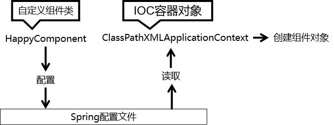

### 技术体系结构

#### 总体技术体系

##### 单一架构

​	一个项目，一个工程，导出为一个war包，在一个Tomcat上运行。


单一架构，项目主要应用技术框架为：Spring、SpringMVC，Mybatis

##### 分布式架构

一个项目，拆分成很多个模块，每个模块是一个IDEA中的一个module。每一个工程都是运行在自己的Tomcat上。模块之间可以互相调用。每一个模块内部可以看成是一个单一架构的应用。


分布式架构，项目主要应用技术框架：SpringBoot(SSM)、SpringCloud，中间件等

#### 框架概念和理解

框架（Framework）是一个集成了基本结构、规范、设计模式、编程语言和程序库等基础组件的软件系统，它可以用来构建更高级别的应用程序。框架的设计和实现旨在解决特定领域的常见问题，帮助开发人员更高效、更稳定地实现软件开发目标。

**框架的优点**

- 提高开发效率
- 降低开发成本
- 提高应用程序的稳定性
- 提高标准化的解决方案

**框架的缺点**

- 可能存在局限性
- 版本变更和兼容性问题
- 架构风险

### SpringFramework

#### Spring和SpringFramework概念

**广义的Spring：Spring技术栈**

广义上的 Spring 泛指以 Spring Framework 为基础的 Spring 技术栈。

经过十多年的发展，Spring 已经不再是一个单纯的应用框架，而是逐渐发展成为一个由多个不同子项目（模块）组成的成熟技术，例如 Spring Framework、Spring MVC、SpringBoot、Spring Cloud、Spring Data、Spring Security 等，其中 Spring Framework 是其他子项目的基础。

这些子项目涵盖了从企业级应用开发到云计算等各方面的内容，能够帮助开发人员解决软件发展过程中不断产生的各种实际问题，给开发人员带来了更好的开发体验。

**狭义的Spring：Spring Framework基础框架**

狭义的 Spring 特指 Spring Framework，通常我们将它称为 Spring 框架。

经过十多年的发展，Spring 已经不再是一个单纯的应用框架，而是逐渐发展成

#### SpringFramework主要功能模块

SpringFramework框架结构图：


| 功能模块       | 功能介绍                                              |
| -------------- | ----------------------------------------------------- |
| Core Container | 核心容器，在Spring环境下使用任何功能都必须基于IOC容器 |
| AOP&Aspects    | 面向切面编程                                          |
| TX             | 声明式事务管理                                        |
| Spring MVC     | 提供了面向Web应用程序的集成功能                       |

#### SpringFramework主要优势

- 丰富的生态系统：Spring生态系统非常丰富，支持许多模块和库，如Spring Boot、Spring Security、Sping Cloud等等，可以帮助开发人员快速构建高可靠性的企业应用程序
- 模块化的设计：框架组件之间的松散耦合和模块化设计使得Spring Framework具有良好的可重用性、可扩张性和可维护性。开发人员可以轻松地选择自己需要的模块，根据自己的需求进行开发
- 简化Java开发：Spring Framework简化了Java开发，提供了各种工具和API，可以降低开发复杂度和学习成本。同时Spring Framework支持各种应用场景，包括Web应用程序、RESTful API、消息传递、批处理等等
- 不断创新和发展：Spring Framework开发团队一直在不断创新和发展，保持与最新的技术接轨，为开发人员提供更加游戏和先进的工具和框架。

Spring 使创建 Java 企业应用程序变得容易。它提供了在企业环境中采用 Java 语言所需的一切，支持 Groovy 和 Kotlin 作为 JVM 上的替代语言，并且可以根据应用程序的需求灵活地创建多种架构。从Spring Framework 6.0.6开始，Spring 需要 Java 17+。

### Spring IoC容器

#### 组件和组件管理概念

三层架构处理请求流程：


整个项目就是由各种组件搭建而成：


#### Spring充当组件管理角色(IoC)

组件可以完全交给Spring框架进行管理，Spring框架替代了开发人员原有的new对象属性赋值动作等

Spring具体的组件管理动作包含：

- 组件对象实例化
- 组件属性的赋值
- 组件对象之间引用
- 组件对象存活周期管理
- 我们只需要编写配置文件告知Spring管理哪些类组件和它们的依赖关系即可；组件是映射到应用程序中所有可重用组件的Java对象，应该是可复用的功能对象
- 组件一定是对象
- 对象不一定是组件

综上所述，Spring充当一个组件容器，创建、管理、存储组件，减少了我们的编码压力，让我们更加专注进行业务编写。

**组件交给Spring管理优势**

- 降低了组件之间的耦合性：Spring IoC容器通过依赖注入机制，将组件之间的依赖关系消弱，减少了程序组件之间的耦合性，使得组件更加松散地耦合
- 提高了代码的可复用性和可维护性：将组件的实例化过程、依赖关系的管理等功能交给Spring IoC容器处理，使得组件代码更加模块化、可重用、更易于维护
- 方便了配置和管理：Spring IoC容器通过XML文件或注解，轻松的对组件进行配置和管理，使得组件的切换、替换等操作更加的方便和快捷。
- 交给Spring管理的对象（组件），方可享受Spring框架的其他功能（AOP、声明事务管理）等

#### 普通容器和复杂容器

普通容器只能用来存储，没有更多功能，如数组、List、Set

复杂容器：Servlet容器能够管理Servlet(init、service、destroy)、Filter、Listener这样的组件的一生，

| 名称       | 时机                                                         | 次数 |
| ---------- | ------------------------------------------------------------ | ---- |
| 创建对象   | 默认情况下：接收到第一次请求 修改启动顺序后：Web应用启动过程中 | 一次 |
| 初始化操作 | 创建对象之后                                                 | 一次 |
| 处理请求   | 接收到请求                                                   | 多次 |
| 销毁操作   | Web应用卸载之前                                              | 一次 |

Spring管理组件的容器，就是一个复杂容器，不仅存储组件，也可以管理组件之间依赖关系，并且创建和销毁组件等

#### SpringIoC容器

SpringIoC容器，负责实例化、配置和组装bean(组件)。容器通过读取配置元数据来获取有关要实例化、配置和组装组件的指令。配置元数据以XML、Java注解或Java代码形式表现。它允许表达组成应用程序的组件以及这些组件之间丰富的互相依赖关系


#### Spring容器接口

`BeanFactory`接口提供了一种高级配置机制，能够管理任何类型的对象，它是SpringIoC容器标准化超接口

`ApplicationContext`是`BeanFactory`的子接口。

- 更容易与Spring的AOP功能集成
- 消息资源处理（易于国际化）
- 特定与应用程序给予此接口实现，如Web应用的WebApplicationContext。换言之。BeanFactory提供了配置框架和基本功能，而ApplicationContext添加了更多特定与企业的功能。ApplicationContext是BeanFactory的完整超集

| 类型名                             | 简介                                                         |
| ---------------------------------- | ------------------------------------------------------------ |
| ClassPathXmlApplicationContext     | 通过读取类路径下的XML配置文件创建IOC容器对象                 |
| FileSystemXmlApplicationContext    | 通过文件系统路径读取XML格式配置文件创建IOC容器对象           |
| AnnotationConfigApplicationContext | 通过读取Java配置类创建IOC容器对象                            |
| WebApplicationContext              | 专门为Web应用准本，基于Web环境创建IOC容器对象，并将对象引入存入ServletContext域中 |

#### SpringIoC容器管理配置方式

Spring IoC容器使用多种形式的配置元数据。此配置元数据表示作为应用程序开发人员如何告知Spring容器实例化、配置和组装到应用程序中的对象。

Spring框架提供了多种配置方式：XML配置方式、注解方式和Java配置类方式

- XML配置方式：是Spring框架最早的配置方式之一，通过在XML文件中定义Bean及其依赖关系、Bean的作用域等信息，让Spring IoC容器来管理Bean之间的依赖关系。该方法从Spring框架的第一版开始提供支持
- 注解方式：Spring2.5版本开始提供支持，可以通过在Bean类上使用注解代替XML配置文件中的配置信息。通过在Bean类上加上相应的注解（如@Component、@Service、@Autowired等），将Bean注册到Spring IoC容器中，这样Spring IoC容器就可以管理这些Bean之间的依赖关系。
- Java配置类方式：从Spring 3.0版本开始提供支持，通过Java类来定义Bean、Bean之间的依赖关系和配置信息。从而代替XML配置文件的方式。Java配置类是一种使用Java编写配置信息的方式，通过@Configuration、@Bean等注解来实现Bean和依赖关系的配置

#### Spring IoC / DI总结

- IoC容器：

  Spring IoC容器，负责实例化、配置和组装bean(组件)核心容器。容器通过读取配置元数据来获取有关要实例化、配置和组装组件的指令

- IoC(Inversion of Control)控制反转：

  IoC主要是针对对象的创建和调用控制而言的，也就是说，当应用程序需要使用一个对象时，不再是应用程序直接创建对象，而是由IoC容器来创建和管理，即控制权由应用程序转移到IoC容器中，也就是反转了控制权。这种方式基本上是通过依赖查询找的方式来实现的，即IoC容器维护着构成应用程序的对象，并负责创建这些对象

- DI(Dependency Injection)依赖注入

  DI是指在组件之间传递依赖关系的过程中，将依赖关系在容器内部进行处理，这样就不必在应用程序代码中硬编码对象之间的依赖关系，实现了对象之间的解耦合。在Spring中，DI是通过XML配置文件或注解的方式实现的。它提供了三种形式的依赖注入：构造函数注入、Setter方法注入和接口注入

### Spring IoC实践和应用

#### Spring IoC/DI实现步骤

**1.配置元数据**

```xml
<?xml version="1.0" encoding="UTF-8"?>
<!-- Spring约束 -->
<beans xmlns="http://www.springframework.org/schema/beans"
       xmlns:xsi="http://www.w3.org/2001/XMLSchema-instance"
       xsi:schemaLocation="http://www.springframework.org/schema/beans http://www.springframework.org/schema/beans/spring-beans.xsd">

    <bean id="happyComponent" class="com.canvs.ioc.ioc01.HappyComponent"/>
</beans>
```

- `id`属性是标识单个Bean定义的字符串

- `class`属性定Bean的类型并使用完全限定的类名

**2.实例化IoC容器**

```java
//实例化ioc容器,读取外部配置文件,最终会在容器内进行ioc和di动作
ApplicationContext context = new ClassPathXmlApplicationContext("services.xml", "daos.xml");
```

**3.获取Bean（组件）**

```java
//创建ioc容器对象，指定配置文件，ioc也开始实例组件对象
ApplicationContext context = new ClassPathXmlApplicationContext("services.xml", "daos.xml");
//获取ioc容器的组件对象
PetStoreService service = context.getBean("petStore", PetStoreService.class);
//使用组件对象
List<String> userList = service.getUsernameList();
```

### 基于XML配置方式组件管理

#### 组件（Bean）信息声明配置IOC



pom.xml

```xml
<dependencies>
        <dependency>
            <groupId>org.springframework</groupId>
            <artifactId>spring-context</artifactId>
            <version>6.0.6</version>
        </dependency>
        <!--junit5测试-->
        <dependency>
            <groupId>org.junit.jupiter</groupId>
            <artifactId>junit-jupiter-api</artifactId>
            <version>5.3.1</version>
        </dependency>
    </dependencies>
```

##### 基于无参数构造函数

组件类

```java
public class HappyComponent {
    public void doWork(){
        System.out.println("HappyComponent.doWork");
    }
}
```

xml配置文件

```xml
<bean id="happyComponent" class="com.canvs.ioc.ioc01.HappyComponent"/>
```

测试

```java
 public void testHappyComponent() {
        HappyComponent happyComponent = context.getBean("happyComponent", HappyComponent.class);
        happyComponent.doWork();
    }
```

> 注意：要求当前组件类必须包含无参数构造函数

##### 基于静态工厂方法实例化

组件类

```java
public class ClientService {
    public static ClientService clientService = new ClientService();
    public static ClientService createInstance(){
        return clientService;
    }
}
```

xml配置文件

```xml
<bean id="clientService" class="com.canvs.ioc.ioc01.ClientService" factory-method="createInstance"/>
```

- factory-method：指定静态工厂方法，该方法必须是**static**方法

测试

```java
public void testClientService() {
        ClientService clientService = context.getBean("clientService", ClientService.class);
        System.out.println(clientService);
    }
```

##### 基于实例工厂方法实例化

```java
public class DefaultServiceLocator {
    public ClientService createClientService(){
        return new ClientService();
    }
}
```

```xml
<bean id="defaultServiceLocator" class="com.canvs.ioc.ioc01.DefaultServiceLocator"/>
    <bean id="clientService1" factory-bean="defaultServiceLocator" factory-method="createClientService"/>
```

- factory-bean属性：指定当前容器中工厂Bean的名称
- factory-method属性：指定实例工厂方法名。实例方法必须是**非static**的

测试

```java
public void testDefaultServiceLocator(){
        ClientService clientService = context.getBean("clientService1", ClientService.class);
        System.out.println(clientService);
    }
```

##### IoC配置流程


#### 组件（Bean）依赖注入配置（DI）


##### 基于构造函数的依赖注入（单个构造参数）

组件类

```java
public class UserService {
    public UserDao userDao;
    public UserService( UserDao userDao) {
        this.userDao = userDao;
    }
}
```

xml配置

- constructor-arg标签：可以引用构造参数ref引用其他bean的标识

```xml
  <bean id="userDao" class="com.canvs.ioc.ioc02.UserDao"/>
    <bean id="userService" class="com.canvs.ioc.ioc02.UserService">
        <constructor-arg name="userDao" ref="userDao"/>
    </bean>
```

测试

```java
  public void testUserService(){
        UserService userService = context.getBean("userService", UserService.class);
        System.out.println(userService.userDao);
    }
```

##### 基于构造函数的依赖注入（多构造参数解析）

组件类

```java
public class UserService {
    public UserDao userDao;
    public int id;
    public String name;

    public UserService( UserDao userDao) {
        this.userDao = userDao;
    }

    public UserService(UserDao userDao, int id, String name) {
        this.userDao = userDao;
        this.id = id;
        this.name = name;
    }

    @Override
    public String toString() {
        return "UserService{" +
                "userDao=" + userDao +
                ", id=" + id +
                ", name='" + name + '\'' +
                '}';
    }
}
```

xml配置文件

- constructor-arg标签：name属性指定参数名、index属性指定参数角标、value属性指定普通属性值

```xml
 <bean id="userService2" class="com.canvs.ioc.ioc02.UserService">
        <constructor-arg name="userDao" ref="userDao"/>
        <constructor-arg name="id" value="1001"/>
        <constructor-arg name="name" value="canvs"/>
    </bean>
```

测试

```java
public void testUserService2(){
        UserService userService1 = context.getBean("userService2", UserService.class);
        System.out.println(userService1);   //UserService{userDao=com.canvs.ioc.ioc02.UserDao@c333c60, id=1001, name='canvs'}
    }
```

##### 基于Setter方法依赖注入

组件类

```java
public class SimpleMovieLister {
    private MovieFinder movieFinder;
    private String movieName;
    public void setMovieFinder(MovieFinder movieFinder) {
        this.movieFinder = movieFinder;
    }

    public void setMovieName(String movieName) {
        this.movieName = movieName;
    }

    public String getMovieName() {
        return movieName;
    }
}
class MovieFinder{

}
```

xml配置文件

- property标签：可以给setter方法对应的属性赋值
- property标签：name属性代表set方法标识、ref代表引用bean的标识id、value属性表示基本属性值

```xml
<bean class="com.canvs.ioc.ioc02.MovieFinder" id="movieFinder"/>
    <bean class="com.canvs.ioc.ioc02.SimpleMovieLister" id="simpleMovieLister">
        <property name="movieFinder" ref="movieFinder"/>
        <property name="movieName" value="喜剧之王"/>
    </bean>
```

测试

```java
   public void testSimpleMovieLister(){
        SimpleMovieLister simpleMovieLister = context.getBean("simpleMovieLister", SimpleMovieLister.class);
        System.out.println(simpleMovieLister.getMovieName());
    }
```

> 总结：依赖注入（DI）包含引用类型和基本数据类型，同时注入的方法也有多种，主流的注入方式为setter方法注入和构造函数注入
>
> 注意：引用其他的bean，使用ref属性。直接注入基本类型值，使用value属性

#### IoC容器创建和使用

**容器实例化**

```java
    public void getBeanFormIoC(){
        ApplicationContext context1 = new ClassPathXmlApplicationContext("Spring-ioc-xml-01.xml");
        ClassPathXmlApplicationContext applicationContext = new ClassPathXmlApplicationContext();
        applicationContext.setConfigLocations("Spring-ioc-xml-01.xml");
        applicationContext.refresh();   //ioc di的动作
    }
```

**Bean对象读取**

- id获取
- id和类型获取
- 类型获取

```java
    public void testHappyComponent() {
        HappyComponent happyComponent = context.getBean("happyComponent", HappyComponent.class);
      Object happyComponent1 = context.getBean("happyComponent");
      HappyComponent happyComponent2 = (HappyComponent1);
      happyComponent.doWork();
    }
```

```java
    public void testHappyComponent2() {
        HappyComponent happyComponent = context.getBean(HappyComponent.class);
        happyComponent.doWork();
    }
```

>根据类型来获取bean时，在满足bean唯一性的前提下，其实只是看：『对象 instanceof 指定的类型』的返回结果，
>只要返回的是true就可以认定为和类型匹配，能够获取到。

#### 组件（Bean）周期方法配置

我们可以在组件类中定义方法，然后当IoC容器实例化和销毁组件对象的时候就行调用。这两个方法我们成为生命周期方法

类似于Servlet的init/destroy方法，我们可以在周期方法完成初始化和释放资源等操作

周期方法声明

```java
public class BeanOne {
    public void init(){
        System.out.println("正在初始化BeanOne");
    }
    public void destroy(){
        System.out.println("BeanOne正在销毁");
    }
}
```

周期方法配置

```xml
<bean id="beanOne" class="com.canvs.ioc.ioc03.BeanOne" init-method="init" destroy-method="destroy"/>
```

测试

```java
    public void testBeanOne(){
        ClassPathXmlApplicationContext applicationContext = new ClassPathXmlApplicationContext();
        applicationContext.setConfigLocations("Spring-ioc-xml-03.xml");
        applicationContext.refresh();
        BeanOne beanOne = applicationContext.getBean("beanOne", BeanOne.class);
        applicationContext.close();
    }
//正在初始化BeanOne
//BeanOne正在销毁
```

#### 组件（Bean）作用域方法配置

Bean作用域概念：\<bean> 标签声明Bean，只是将Bean的信息配置交给SpringIoC容器。

在IoC容器中，这些\<bean>标签对应的信息转成Spring内部 `Beandefinition` 对象，Beandefinition对象内，包含定义的信息(id、class、属性等等)

这意味着，Beandefinition与类概念一样，SpringIoC容器可以根据 Beandefinition对象反射创建多个Bean对象实例。具体创建多少个Bean的实例对象，由Bean的作用域 Scope 属性指定

**作用域可选值**

| 取值      | 含义                                    | 创建对象时机    | 默认值 |
| --------- | --------------------------------------- | --------------- | ------ |
| singleton | 在IOC容器中，这个bean的对象始终为单实例 | IOC容器初始化时 | 是     |
| prototype | 这个bean在IOC容器中有多个实例           | 获取bean时      | 否     |

**如果是在WebApplicationContext环境下还会有另外两个作用域**

| 取值     | 含义                 | 创建对象时机 | 默认值 |
| -------- | -------------------- | ------------ | ------ |
| request  | 请求范围内有效的实例 | 每次请求     | 否     |
| response | 会话范围内有效的实例 | 每次会话     | 否     |

xml配置scope

```xml
 <!--  scope默认值是singleton   -->
    <bean id="beanOne2" class="com.canvs.ioc.ioc03.BeanOne" scope="singleton"/>
    <bean id="beanOne3" class="com.canvs.ioc.ioc03.BeanOne" scope="prototype"/>
```

测试

```java
public void testBeanOne2(){
        ApplicationContext context = new ClassPathXmlApplicationContext("Spring-ioc-xml-03.xml");
        BeanOne beanOne2 = context.getBean("beanOne2", BeanOne.class);
        BeanOne beanOne3 = context.getBean("beanOne2", BeanOne.class);
        System.out.println(beanOne3 == beanOne2);   //true
        BeanOne beanOne4 = context.getBean("beanOne3", BeanOne.class);
        BeanOne beanOne5 = context.getBean("beanOne3", BeanOne.class);
        System.out.println(beanOne5 == beanOne4);   //false
    }
```

